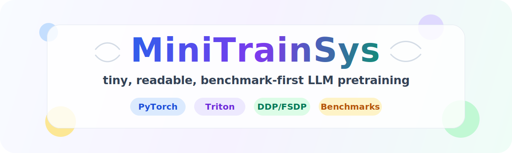

<div align="center">



**一个用于学习 LLM 数据、模型、算子和分布式训练的可读小型系统。**

</div>

## 这个项目解决什么问题

MiniTrainSys 不是通用大模型平台，也不是只有一个 `train.py` 的教学 demo。它把一条
完整训练链拆成可单独阅读、测试和替换的模块：

```text
原始文档 → tokenizer → token shards → Dataset/Sampler/DataLoader
        → MiniTransformer(Dense 或 MoE) → Torch/Triton/CUDA 算子
        → single/DDP/FSDP → AdamW/LR/epoch → DCP checkpoint
        → evaluate / P-probe / Q-probe / router analysis
```

当前最完整的端到端实验是 Allen-Zhu bioS 协议的 SynBioS MoE 复现。项目同时包含
Triton/CUDA kernel 学习、单机 1/4/8×RTX 4090 分布式 benchmark，以及带 Adam 状态的
可恢复训练。

## 建议阅读顺序

第一次阅读不要从 kernel 开始。按下面顺序走一遍，能先建立完整心智模型：

1. [项目全流程导读](docs/guides/project_walkthrough.md)：一次 batch 如何穿过整个系统。
2. [代码架构](docs/guides/architecture.md)：每个目录负责什么，模块边界为什么这样划分。
3. [数据流水线](docs/data/data_pipeline.md)：Document、chunk、token shard、Dataset、Sampler。
4. [配置说明](configs/README.md)：YAML `extends`、batch、worker、checkpoint 等参数。
5. [单卡/DDP/FSDP 手册](docs/training/distributed_training.md)：训练与恢复的真实执行方式。
6. [监控与恢复](docs/training/monitoring_and_recovery.md)：ETA、显存、梯度和 checkpoint。
7. [SynBioS 全流程](docs/experiments/synbios_moe_training_flow.md)：数据生成、主训练、probe、结果。
8. [Kernel 与 benchmark 路线](docs/README.md#算子与性能)：进入 Triton/CUDA 深入材料。

所有文档的分类和“当前手册/历史设计记录”标记见 [文档地图](docs/README.md)。

## 安装

需要 Python 3.10+。Linux/CUDA 服务器推荐：

```bash
python -m venv .venv
source .venv/bin/activate
pip install -e ".[triton,data,dev]"
```

Windows：

```powershell
python -m venv .venv
.\.venv\Scripts\Activate.ps1
pip install -e ".[data,dev]"
```

Linux/NVIDIA 实验服务器可以从干净 checkout 一键创建 `.venv`、安装已验证的
PyTorch/CUDA/Triton 组合并执行环境预检。先把实验产物和编译缓存映射到挂载盘，
再安装环境：

```bash
bash scripts/bash/setup_storage.sh /data
bash scripts/bash/setup_server.sh
```

系统盘/挂载盘分工、已有数据迁移、系统依赖、GPU/NCCL 验收、smoke 和正式实验前清单见
[`docs/guides/server_setup.md`](docs/guides/server_setup.md)。

开发 CUDA C++ 扩展时再安装 `.[cuda]`。训练 notebook 必须使用与命令行相同的
Python 环境，否则容易出现 Jupyter 能 import、`!python` 却找不到依赖的问题。

## 先跑最小闭环

CPU/debug 配置验证模型、优化器、日志和 checkpoint 调用链：

```bash
python scripts/train.py \
  --config configs/train_debug.yaml \
  --model-config configs/model_debug_dense.yaml \
  --device cpu
```

SynBioS 的可执行 notebook 会依次跑数据准备、主训练、评估、P/Q probe 和 router：

```bash
jupyter notebook tests/synbios_moe_end_to_end.ipynb
```

它默认只运行 100 人、2 个主训练 step 和 3 个 probe step，是结构测试，不是论文结果。

## 正式训练入口

模型配置与运行配置分开传入：模型配置决定层数、宽度、Dense/MoE；运行配置决定
数据、优化器、精度、并行方式、epoch 和 checkpoint。

```bash
python scripts/train.py \
  --device cuda \
  --config configs/server/rtx4090_24gb/runs/single_1gpu.yaml \
  --model-config configs/model_125m_moe.yaml
```

单机 4/8 卡服务器：

```bash
NPROC=4 MODEL_CONFIG=configs/model_125m_moe.yaml bash scripts/bash/distributed.sh ddp
NPROC=8 MODEL_CONFIG=configs/model_125m_moe.yaml bash scripts/bash/distributed.sh ddp
NPROC=4 MODEL_CONFIG=configs/model_125m_moe.yaml bash scripts/bash/distributed.sh fsdp
NPROC=8 MODEL_CONFIG=configs/model_125m_moe.yaml bash scripts/bash/distributed.sh fsdp
```

固定拓扑配置会校验 `WORLD_SIZE`，避免 4 卡配置误跑成 8 卡。当前没有梯度累计：

```text
global_batch = train.batch_size（每 rank）× WORLD_SIZE
```

## 数据和 DataLoader

通用预处理入口是 `scripts/prepare_data.py`，SynBioS 使用
`scripts/synbios_moe.py prepare`。训练读取 manifest 和 mmap token shards，不把整个
语料加载进 GPU。

多卡时所有 rank 根据同一确定性顺序取得互不重叠的数据。`data.num_workers: null`
表示按单机 CPU 预算自动分配：默认节点总预算 32、每 rank 最多 4，并为训练进程
保留 CPU 核。详细设计见 [数据流水线](docs/data/data_pipeline.md)。

## Checkpoint 与恢复

每个有效 checkpoint 是带 `COMMITTED` 标记的目录：

```text
checkpoints/<run>/epoch_..._step_.../
├── distributed/       # DCP 模型和 Adam 分片
├── runtime.pt         # scheduler/scaler/计数器/resolved config
├── rng_rank_*.pt      # 每 rank RNG
├── model.pt           # 可选，只供 evaluate/probe
└── COMMITTED
```

恢复完整训练状态：

```bash
python scripts/train.py --device cuda \
  --config <run.yaml> --model-config <model.yaml> --resume latest
```

Probe 只读取 `model.pt`，不会加载主训练 Adam。DCP、跨 world-size 恢复和 epoch 语义见
[分布式训练手册](docs/training/distributed_training.md)。

## 测试与 benchmark

```bash
python -m pytest -q
python -m ruff check minitrain scripts tests
```

主要 notebook：

| Notebook | 用途 |
|---|---|
| `tests/example_training.ipynb` | 模型、LR、checkpoint 小实验 |
| `tests/synbios_moe_end_to_end.ipynb` | SynBioS 端到端结构测试 |
| `tests/operator_bench.ipynb` | 通用算子正确性与性能 |
| `tests/moe_operator_bench.ipynb` | Router 与 fused MoE |
| `tests/distributed_server_benchmark.ipynb` | 1/4/8 卡 DDP/FSDP 弱扩展和显存容量 |

分布式 benchmark 不只报 tokens/s，还记录 step P50/P95、数据等待、单卡和全系统显存、
OOM 边界、硬件拓扑及 Git 状态。协议见 [分布式 benchmark](docs/benchmarks/distributed_benchmark.md)。

## 目录地图

```text
configs/       模型、数据、策略、硬件拓扑和具体 run
docs/
  guides/      项目导读、架构和阅读导航
  data/        数据流水线
  training/    训练、分布式、监控和恢复
  experiments/ SynBioS 流程与 fidelity
  benchmarks/  性能规范和硬件容量
  model/       MoE 等模型专题
  kernels/     CUDA/Triton 深入材料
  design-notes/ 历史设计记录
  references/  外部参考和实现映射
experiments/   SynBioS 的数据、probe、评估与 router 分析
minitrain/
  data/        文档读取、tokenizer、预处理、Dataset/Sampler/DataLoader
  model/       Transformer、Dense/MoE block、router、算子协议
  kernels/     PyTorch 基线、Triton、CUDA C++ 扩展
  distributed/ single、DDP、FSDP 策略
  runtime/     typed config、factory、device、logger、batch scaling
  train/       单 step Trainer、epoch Runner、AdamW、LR、DCP
scripts/       用户入口；Python/Bash/PowerShell 分开
tests/         pytest、教学 notebook 和 benchmark notebook
reports/       选定 benchmark 报告与图表
```

`scripts/eval.py` 和 `scripts/sample.py` 目前仍是通用占位入口；可用的实验评估入口是
`scripts/synbios_moe.py evaluate/probe/analyze`。这一区分很重要，避免把 scaffold 当成
已经完成的功能。

## 清理生成文件

清理脚本只处理声明过的临时/构建产物；checkpoint 和昂贵 benchmark 结果需要确认后
自行归档：

```powershell
powershell -ExecutionPolicy Bypass -File scripts/powershell/clean.ps1
```

```bash
bash scripts/bash/clean.sh
```

训练与 SynBioS 后训练的指标、TensorBoard、checkpoint 内容和跨卡恢复方式见
[`docs/training/monitoring_and_recovery.md`](docs/training/monitoring_and_recovery.md)。

## License

项目代码使用 MIT License；第三方 kernel 代码的许可证随对应包保存。
