<div align="center">


<p>
  
  
  
  
  <a href="LICENSE"></a>
</p>

</div>

---

<a id="overview"></a>

## 🧭 Overview

MiniTrainSys is a **from-source LLM training system**. It is not a wrapper around a ready-made
trainer: this repository implements the data path, Transformer and MoE blocks, operator dispatch,
training loop, distributed lifecycle, checkpoint contract, benchmarks, and analysis protocol. PyTorch
provides the tensor and distributed primitives; the training system built on top is owned here.

Its layered design keeps data preparation, Transformer structure, operator backends, distributed
execution, and training state separate, so each can be changed and validated without turning the
rest of the stack into a black box.

It trains Dense and 293M-parameter sparse MoE models through PyTorch, Triton, and native CUDA
paths. The same system supports a controlled study of how factual knowledge becomes readable in
MoE: data conditions, frozen-backbone P/Q probes, and route-level diagnostics are all part of the
repository.

### 🗺️ Scope

| Area | What is implemented here |
|---|---|
| **Models and data** | Model YAMLs select Dense or top-2 MoE blocks and set depth, width, heads, sequence length, and expert shape. The formal workload is a 12-layer, 293.49M-parameter MoE; data supports byte-level BPE or recorded tiktoken tokenizers, mmap token shards, document offsets, and manifests. |
| **Operator backends** | A common `OpsBackend` interface with PyTorch reference paths, Triton kernels for the Transformer/MoE operators, and a native CUDA FlashAttention path. |
| **Training runs** | Single-GPU, DDP, and FSDP execution; BF16, typed model/run YAMLs, JSONL and TensorBoard logging, and DCP checkpoint save/resume. |
| **SynBioS experiments** | `single` and `multi5_permute` factual-recall corpora; cloze validation; frozen-backbone P/Q linear probes; and token-conditioned expert-route DiD. |

## 📖 Contents

| Read the results | Understand the system | Run the project |
|---|---|---|
| [🔥 Performance](#benchmarks) | [🧩 System Design](#system-design) | [⚡ Kernel Engineering](#kernel-engineering) |
| [🚄 Training Performance](#training-performance) | [🧠 Model Interpretability](#interpretability) | [🚀 Quick Start](#quick-start) |
| [📊 Reproducibility](#reproducibility) | [🗂️ Project Structure](#project-structure) | [📦 Data and Configuration](#data-and-configuration) |
| [🛠️ Training Workflows](#training-workflows) | [🛡️ Reliability](#reliability) | [📚 Documentation](#documentation) |
<!-- | [📖 References](#references) |  |  | -->

<a id="benchmarks"></a>

## 🔥 Performance at a glance

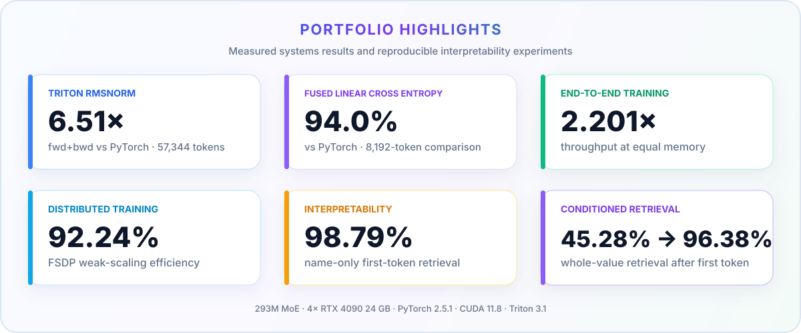

| Measurement | Result |
|---|---:|
| Kernel suite, full forward + backward | **1.22–6.51×** over the corresponding PyTorch operator |
| Fused Linear Cross Entropy, peak allocated memory | **94.0% lower** than the explicit-logits PyTorch path |
| 293M MoE, local batch 24 on every backend | CUDA: **1.456×** PyTorch token throughput |
| 293M MoE, matched memory budget | CUDA: local batch **24 → 96** and **2.201×** PyTorch token throughput |
| FSDP weak scaling, 1 → 4 GPUs | **3.69×** throughput; **92.24%** parallel efficiency |
| `multi5_permute` Q-first macro, name-only context | **98.79%**, compared with **12.83%** for `single` |
| `multi5_permute` P-whole, P-first classifier output appended | **45.28% → 96.38%** after training a fresh probe |

All server results were produced on the same 4× RTX 4090 24 GB machine with PyTorch 2.5.1+cu118, CUDA 11.8, and Triton 3.1.

<a id="system-design"></a>

## 🧩 System design

The code is split into data, model, execution, and analysis layers. A training run moves from
documents to token shards, through the model and selected backend, then into training, checkpoints,
and analysis.

<div align="center">
  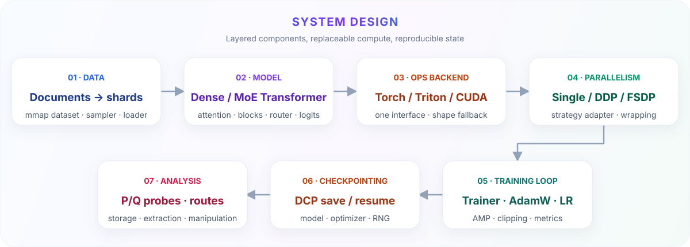
</div>

`OpsBackend` is the main boundary: model code calls the same interface whether an operator is
implemented in PyTorch, Triton, or CUDA.

| Layer | Main code | Responsibility |
|---|---|---|
| Data | `minitrain/data` | Tokenization, shards, datasets, and loading |
| Model and kernels | `minitrain/model`, `minitrain/kernels` | Dense/MoE Transformer and operator backends |
| Training | `minitrain/distributed`, `minitrain/train` | Single/DDP/FSDP, optimization, and checkpoints |
| Analysis | `experiments/synbios_moe` | Recall, P/Q probes, and route analysis |

<a id="kernel-engineering"></a>

## ⚡ Kernel engineering

This section compares each custom kernel with the equivalent PyTorch path used by the same
293.49M MoE workload. Every number covers **forward + backward**, not forward-only microbenchmarks.

How to read the table:

- **Speedup** is elapsed-time improvement over PyTorch at the same shape; `2.00×` means half the time.
- **Peak allocation reduction** is the reduction in PyTorch-reported peak allocated GPU memory.
<!-- - If PyTorch cannot fit the formal shape, speed is measured at the largest shape both paths can run.
  A larger fused-only shape is reported separately as a **capacity** result, never as a speedup. -->

The representative workload uses BF16 with hidden size 768, 8 experts, top-2 routing, vocabulary
size 50,257, and up to 57,344 tokens per rank. Each case runs in a fresh CUDA process with warmup,
synchronization, repeated trials, and P50/P95 latency collection. Custom paths must pass forward /
backward parity, dtype and reduction checks, boundary/strided-shape checks, and fallback checks
before they are benchmarked.

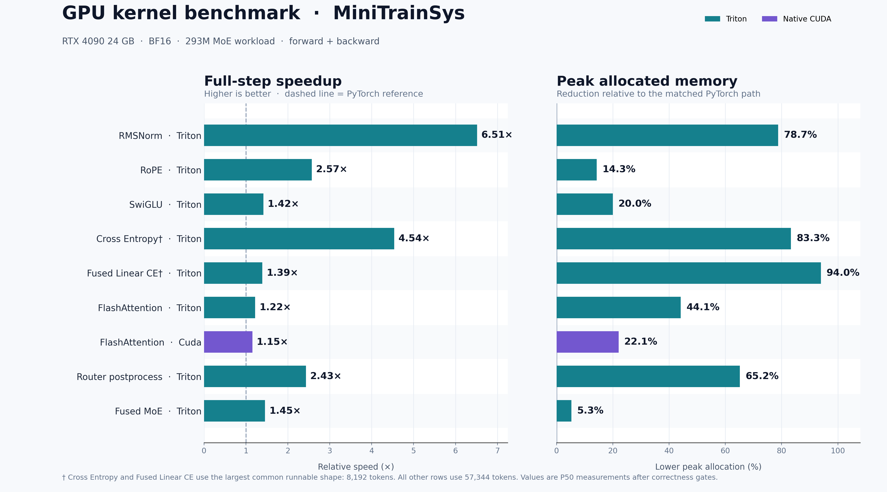

| Operator | Implementation | Primary benefit |
|---|---|---|
| RMSNorm | Normalize and scale in one row-wise kernel | Fewer launches and memory round-trips |
| RoPE | Tile token/head rows; reuse Q/K sinusoids | Reduces small-kernel launch and bandwidth cost |
| SwiGLU | Keep activation and gate product fused | Avoids a temporary activation tensor |
| Cross Entropy | Stream vocabulary blocks with online log-sum-exp | Avoids the full probability matrix |
| Fused Linear CE | Consume LM-head logits immediately | Avoids materializing `[tokens, vocab]` logits |
| FlashAttention† | Specialized Triton attention path | Reduces attention I/O and saved tensors |
| Native CUDA Attention†‡ | Compiled FlashAttention shape buckets | Low-level, shape-specialized attention |
| Router postprocess | Fuse softmax, top-k, weights, losses, and stats | Avoids repeated scans of router logits |
| Fused MoE | Fuse dispatch, expert execution, and weighted gather | Reduces irregular MoE dispatch overhead |

<sub>† Attention rows are measured against PyTorch's <code>aten::_scaled_dot_product_flash_attention</code> backend.</sub>

<sub>‡ Native CUDA Attention adapts the upstream FlashAttention 2.8.4 CUDA kernels; MiniTrain owns the tensor interface and build specialization.</sub>

<details open>
<summary><strong>What the main kernels do</strong></summary>

<details>
<summary><strong>RMSNorm</strong> — Speed: <strong>6.51×</strong> · Peak allocation: <strong>−78.7%</strong></summary>

For each hidden row $x \in \mathbb{R}^{H}$, the forward pass is

$r = \frac{1}{\sqrt{\mathrm{mean}(x^2) + \varepsilon}}, \qquad y = x \odot r \odot \gamma.$

One Triton program owns one row (or packs short rows), reduces `sum(x²)` in FP32, and writes `y`
once. It saves `r` per row. Backward reads `x`, `γ`, `r`, and `dy` to form `dx` and `dγ`; it does
not re-run the reduction. Parallelism is over rows, with the hidden dimension reduced inside the
program.

</details>

<details>
<summary><strong>RoPE</strong> — Speed: <strong>2.57×</strong> · Peak allocation: <strong>−14.3%</strong></summary>

For every rotary pair $(a,b)$ at position $t$, forward applies

$a' = a\cos(t) - b\sin(t), \qquad b' = a\sin(t) + b\cos(t).$

One program owns one `(batch, token)` position and lays out all Q/K heads and rotary pairs as a
tile. `sin(t)` and `cos(t)` are loaded once for that position and shared across heads; there is no
host-side loop over heads. Backward applies the inverse rotation to `dq` and `dk` using the same
tile. The gain is mostly fewer launches and less temporary traffic.

</details>

<details>
<summary><strong>SwiGLU</strong> — Speed: <strong>1.42×</strong> · Peak allocation: <strong>−20.0%</strong></summary>

With gate projection $g$ and up projection $u$, forward is

$y = \mathrm{SiLU}(g) \odot u, \qquad \mathrm{SiLU}(g) = g\,\sigma(g).$

Each program covers a tile of the activation. It loads `g` and `u`, evaluates the gate and product
in registers, then stores only `y`. Backward uses $dy$ to form
$du = dy \odot \mathrm{SiLU}(g)$ and
$dg = dy \odot u \odot \mathrm{SiLU}'(g)$ in the same tiled layout. **20.0% lower peak allocation.**

</details>

<details>
<summary><strong>Cross Entropy</strong> — Speed: <strong>4.54×</strong> · Peak allocation: <strong>−83.3%</strong></summary>

For a target class $c$ and logits $z$, forward evaluates

$L = -z_c + \log\!\sum_v \exp(z_v), \qquad \frac{\partial L}{\partial z_v} = \frac{\mathrm{softmax}(z)_v - \mathbf{1}[v=c]}{N_{\mathrm{valid}}}.$

The vocabulary is read in blocks. Online log-sum-exp retains only a running maximum and running
sum, rather than a full probability vector. A program owns one token row while lanes cover a
vocabulary block. **83.3% lower peak allocation** at the largest common shape.

</details>

<details>
<summary><strong>Fused Linear Cross Entropy</strong> — Speed: <strong>1.39×</strong> · Peak allocation: <strong>−94.0%</strong></summary>

The LM head and CE are fused across token chunks. For a chunk $C$:

$Z_C = X_C W^\top, \qquad \frac{\partial L}{\partial X_C} = \frac{\partial L}{\partial Z_C}W, \qquad \frac{\partial L}{\partial W} \mathrel{+}= \left(\frac{\partial L}{\partial Z_C}\right)^\top X_C.$

**Forward.** Choose the largest power-of-two number of tokens whose temporary
`[chunk_tokens, vocab]` logits buffer fits the 64 MiB workspace budget. For one chunk, it adds the
online CE loss to a running scalar, overwrites `Z_C` with `∂L/∂Z_C`, computes the gradients above,
then reuses that workspace for the next chunk—there is never an `[all_tokens, vocab]` logits matrix.

**Backward.** The custom autograd forward has already materialized the chunk gradients, so backward
normally returns saved `dX` and `dW`, only scaling them when the upstream loss gradient is not one.
At 57,344 tokens, the fused path adds 356 MiB while the
explicit-logits baseline does not fit (**94.0% lower peak allocation**).

</details>

<details>
<summary><strong>FlashAttention</strong> — Triton (Speed: <strong>1.22×</strong>; Peak allocation: <strong>−44.1%</strong>) · CUDA (Speed: <strong>1.15×</strong>; Peak allocation: <strong>−22.1%</strong>)</summary>

Forward computes $O = \mathrm{softmax}(QK^\top / \sqrt{d})V$ without storing the
$S \times S$ score matrix. A program owns
one `(batch, head, query-tile)` and streams successive K/V tiles. It carries online softmax
statistics `(m, l)` for the query tile and updates `O` as each K/V tile arrives; heads are
independent programs.

Backward first runs a small preprocess kernel for each query row:

$D_i = \sum_d O_{id}\,dO_{id}.$

`D` is one FP32 scalar per row (named `Delta` in the code). The two tiled backward paths then
recompute $P = \exp(QK^\top / \sqrt{d} - \mathrm{LSE})$ from Q/K and the saved row LSE, rather
than reading a saved probability matrix. For each tile:

$dP = dO\,V^\top, \qquad dS = P \odot (dP - D),$

$dV = P^\top dO, \qquad dK = \frac{dS^\top Q}{\sqrt{d}}, \qquad dQ = \frac{dS K}{\sqrt{d}}.$

The K/V-tile kernel scans query tiles and accumulates $dK$ and $dV$; the Q-tile kernel scans K/V
tiles and accumulates $dQ$.
Thus `dQ` is written by its owning query tile, while `dK` and `dV` are written by their owning K/V
tile—no atomic accumulation and no $S \times S$ score/probability tensor. Tile sizes are selected per
shape. The baseline is PyTorch Flash-SDPA (`aten::_scaled_dot_product_flash_attention`), not naive
$QK^\top \rightarrow \mathrm{softmax} \rightarrow V$: Triton reduces allocation by **44.1%**; the native CUDA path reduces it by
**22.1%**. See [raw dispatch evidence](results/benchmarks/operator_benchmark/resume_summary/torch_attention_backend.json).

</details>

<details>
<summary><strong>Router postprocess</strong> — Speed: <strong>2.43×</strong> · Peak allocation: <strong>−65.2%</strong></summary>

For router logits $r_t$, the forward pass computes $p_t = \mathrm{softmax}(r_t)$, selects
$\mathrm{topk}(p_t)$, and optionally renormalizes the selected weights:

$w_{tj} = \frac{p_{t,e_j}}{\sum_{j' \in \mathrm{topk}(p_t)} p_{t,e_{j'}}}.$

The same pass accumulates mean expert probability, z-loss, and entropy statistics. A program covers
a small block of token rows and all experts for those rows, writing only `k` weights and indices per
token rather than a retained probability matrix. Backward receives gradients from selected weights,
load-balance statistics, and z-loss, then writes `dr` through the softmax/top-k normalization path;
expert indices are non-differentiable. **65.2% lower peak allocation.**

</details>

<details>
<summary><strong>Fused MoE</strong> — Speed: <strong>1.46×</strong> · Peak allocation: <strong>−5.3%</strong></summary>

For selected expert $e_j$ and routing weight $w_{tj}$, forward is

$h_{tj} = \mathrm{SiLU}(x_t W_{\mathrm{gate},e_j}^\top) \odot (x_t W_{\mathrm{up},e_j}^\top), \qquad y_t = \sum_j w_{tj}\,h_{tj}W_{\mathrm{down},e_j}^\top.$

It first builds expert counts, prefix sums, and scatter indices, then groups the `T × k` routed
copies into expert-contiguous tiles. Each expert tile runs fused gate/up projection plus SwiGLU,
then down projection; a final kernel gathers weighted outputs back to token order.

Backward expands `dy` to routed copies, computes `dWdown`, `dWgate/up`, `dx`, and `dw` in those same
expert tiles, then gathers per-route `dx` to each original token. Routing indices have no gradient;
the weight gradient returns to the router. This removes standalone dispatch, expert, and gather
stages.

</details>

</details>

<a id="training-performance"></a>

## 🚄 Training performance

Operator speedups matter only if they improve a complete training step. The backend benchmark
therefore measures data loading, forward, backward, optimizer, logging, and synchronization
together.

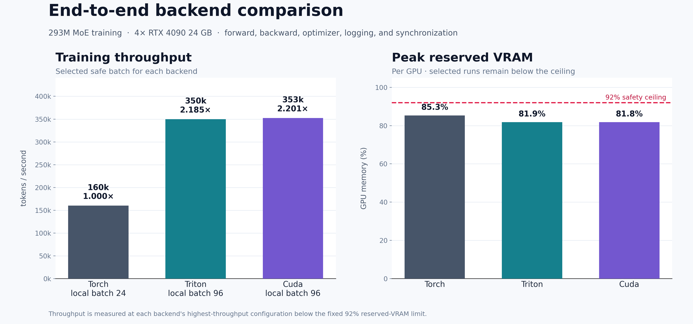

<sub>Backend routing: <code>cuda</code> inherits <code>triton</code> and overrides only FlashAttention; all other operators use the same Triton paths. Unsupported native CUDA attention dispatches <code>CUDA → Triton → PyTorch</code>.</sub>

| Condition | PyTorch | Triton | CUDA |
|---|---:|---:|---:|
| Equal local batch | 24 | 24 | 24 |
| Relative throughput | 1.000× | 1.393× | **1.456×** |
| Largest memory-safe local batch | 28 | 96 | **112** |
| Equal-budget relative throughput | 1.000× | 1.994× | **2.201×** |

The largest safe batch is not automatically the fastest. Capacity sweeps therefore choose the
highest measured throughput below the accepted memory ceiling rather than simply selecting the
largest runnable allocation.

### 📈 FSDP scaling

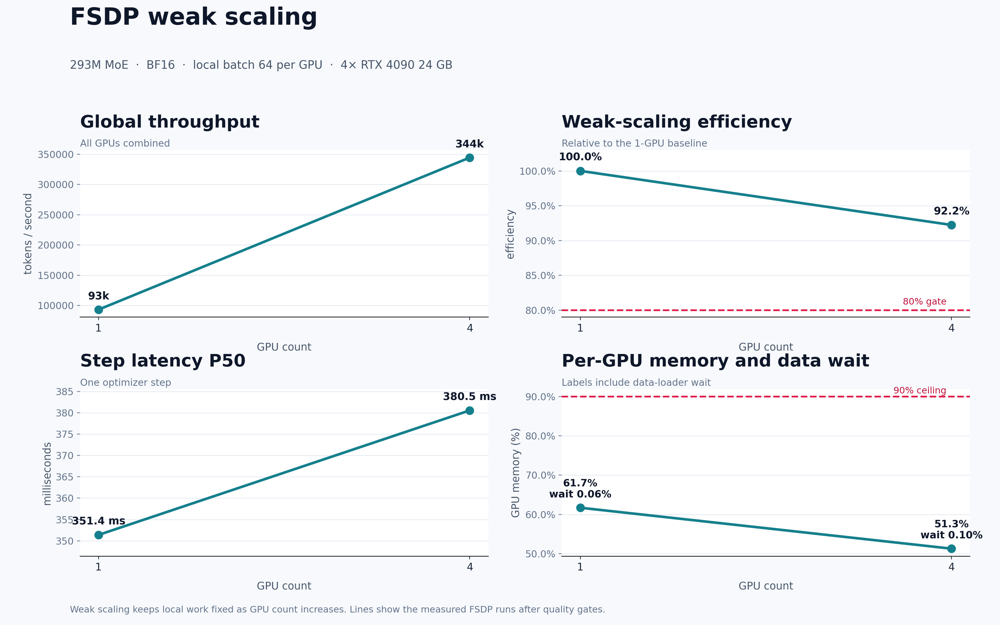

FSDP reaches **3.69× weak scaling from one to four GPUs**, or **92.24% parallel efficiency**.
Residual loss comes from FSDP all-gather/reduce-scatter and synchronization over a PCIe `SYS`
topology; this machine has no NVLink.

<a id="interpretability"></a>

## 🧠 Model interpretability

The interpretability track uses a controlled synthetic-biography experiment to study how a 293M
sparse MoE retrieves memorized facts. Each condition uses 100,000 people with six facts each. Both
backbones use the same 12-layer, hidden-768, 8-expert top-2 MoE: 293.49M total parameters and
123.62M token-active parameters. Formal pretraining uses BF16 and four-GPU FSDP.
<!-- The complete
training budgets are: -->

<!-- <div align="center">
  <code>two data layouts</code> &nbsp;→&nbsp; <code>cloze recall</code> &nbsp;→&nbsp; <code>frozen P/Q readout</code> &nbsp;→&nbsp; <code>route DiD + t1 intervention</code>
</div> -->

| Dataset | People | Biographies / person | Documents | Epochs | Optimizer steps | Total scheduled tokens |
|---|---:|---:|---:|---:|---:|---:|
| `single` | 100,000 | 1, fixed field order | 100,000 | 540 | 17,280 | 3,963,617,280 |
| `multi5_permute` | 100,000 | 5, independently rewritten and shuffled | 500,000 | 108 | 17,388 | 3,988,389,888 |

Both models are pretrained from scratch with the same tokenizer, next-token objective, optimizer,
seed 1337, and global batch 448. Only biography presentation and the epoch count differ.
`multi5_permute` has five times as many documents, so it uses one fifth as many epochs. The two
budgets differ by 24,772,608 tokens (0.62%); both are approximately 4B-token runs. Their
`profiles.jsonl` files are byte-identical, ensuring that only presentation differs.

### 🧪 Two pretraining conditions and cloze recall

| Recall metric | `single` | `multi5_permute` |
|---|---:|---:|
| Strict field accuracy | **100.000000%** | **99.991533%** |
| All-six-fields biography accuracy | **100.0000%** | **99.9626%** |
| Evaluation coverage | 100k biographies / 600k fields | 500k biographies / 3M fields |

The cloze evaluator removes the six exact fact spans from each source biography and regenerates
them greedily in source-text order. Earlier predictions are inserted back into the context before
later fields are generated. No parameters are trained in this stage; it checks source-corpus recall
before any representation analysis.

The augmented model misses only 254 of 3,000,000 strict fields. **Both models pass the
cloze/source-recall gate before probing begins.** These are training-corpus recall results, not
held-out generalization results.

### 🔎 P and Q probes for knowledge storage

We then ask where the learned facts can be read from the frozen MoE. The P/Q setup follows the
distinction in [Allen-Zhu and Li, *Physics of Language Models: Part 3.1*](https://arxiv.org/abs/2309.14316):
P reads a biography-prefix state; Q reads only the final state of `[EOS, full_name, EOS]`.

| Probe | Input / read position | `first` target | `whole` target |
|---|---|---|---|
| P | Biography prefix, hidden state before the attribute | First BPE token | Complete attribute class |
| Q | `[EOS, full_name, EOS]`, read at the final EOS | First BPE token | Complete attribute class |

The read positions are easiest to see on one generated `single` biography. This is person 0 from
the seed-1337 corpus; each bracketed preposition is the token whose final-layer state P reads:

```text
Jonah15 Blair13 Carter36 entered the world [P0: on] October 24, 2046.
He was born [P1: in] Tacoma9, NC.
He received mentorship [P2: at] Chicago8 University.
He specialized [P3: in] Political Science2.
He was employed [P4: by] Brooks9 Group.
He was professionally based [P5: in] Albany3, GA.

P-company: [biography start → ... → "employed" → P4: " by"] → predict " Brooks9 Group"
Q-company: [EOS] → Jonah15 Blair13 Carter36 → |Q: EOS| → predict " Brooks9 Group"
```

Thus P asks what is readable immediately before an attribute in its source biography; Q asks what
is readable from the name alone, with no biography facts in the input.

The pretrained backbone is frozen for every P/Q task. Let the frozen embedding table be
$E \in \mathbb{R}^{V \times H}$. The probe learns $A \in \mathbb{R}^{V \times r}$ and
$B \in \mathbb{R}^{r \times H}$:

$$
E' = E + AB, \qquad e'_t = e_t + A_tB.
$$

Here $t$ is a token ID and $A_t$ is its rank-*r* row. $B$ starts at zero, so the probe begins with
the exact pretrained embeddings. At its chosen read position, it applies a normalizer and linear
head:

$$
\mathrm{logits} = W_{\mathrm{cls}}\,\mathrm{Norm}(h_L[\mathrm{position}]) + b_{\mathrm{cls}}.
$$

This is not LoRA on Transformer weights: only `A`, `B`, the normalizer, and classifier train; all
attention, MoE, backbone normalization, and LM-head parameters stay fixed. With `V = 50,257` and
`H = 768`, the rank-2 P delta has 102,050 parameters; the rank-16 Q delta has 816,400.

| Probe | Input and readout position | Trainable probe | Rank | First / whole budget |
|---|---|---|---:|---:|
| P | Full biography; read P0–P5 immediately before each fact span | Embedding delta + LayerNorm + classifier | 2 | 4,000 / 12,000 steps; batch 128 |
| Q | `[EOS, full_name, EOS]`; read the final EOS | Embedding delta + BatchNorm + classifier | 16 | 4,000 / 12,000 steps; batch 768 |

Formal probes use cross entropy and AdamW (`lr=1e-3`, `weight_decay=0.3`, `eps=1e-6`) with no
warmup and linear decay to zero; all runs use seed 1337.

P positions are ordered by where facts occur in that rendered biography, not by a fixed semantic
attribute index. Only complete BPE tokens ending before the attribute span are included. For
non-date attributes, `first` is the first GPT-2 token of `" " + full_value`; `whole` is the exact
complete value treated as one class. Birth date uses its month as the first-token target and has no
whole-value task. Each attribute/target pair has an independent classifier.

Probe heads train on 49,882 people and validate in `eval()` mode on the other 50,118. Those people
are held out from probe training, but not from backbone pretraining. P validation batches are 512;
Q validation batches are 6,144.

#### 🟢 First-token retrieval

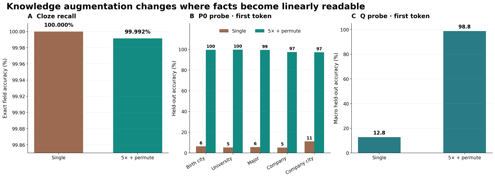

| Probe endpoint | `single` | `multi5_permute` |
|---|---:|---:|
| P0-first | 6.76% | **98.63%** |
| Q-first macro | 12.83% | **98.79%** |

**In `single`, a fact is most readable near its original position; with rewrites and field
permutation, its first token becomes nearly linearly readable from the name alone.**

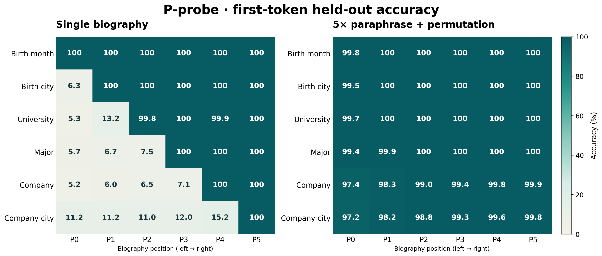

<div align="center">
  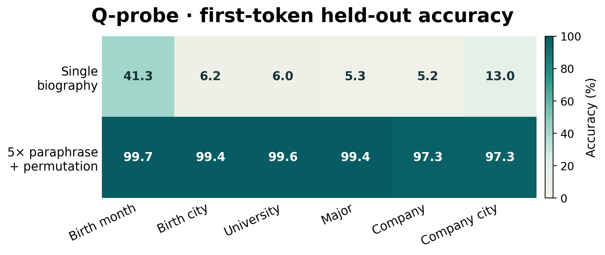
</div>

#### 🧾 Whole-value retrieval

The first difference is the whole-value gap. Allen-Zhu's augmented dense model reports **92.58%**
Q-whole accuracy; this MoE reaches **98.79%** on Q-first but only **33.15%** on Q-whole. In other
words, **augmentation makes a name a strong linear cue for the first token, not for the entire
value as one linear readout in MoE architecture.**

| Five-attribute macro | `single` MoE | `multi5_permute` MoE | Dense `multi5+permute` |
|---|---:|---:|---:|
| P1-whole | 13.92% | **39.66%** | **93.56%** |
| Q-whole | 3.18% | **33.15%** | **92.58%** |

<sub>Dense references use `bioS multi5+permute`: P1-whole is the Figure 13(c) rank-2 macro of
96.4, 76.0, 96.0, 99.7, and 99.7; Q-whole is the Figure 7 macro of 96.1, 72.6, 94.9, 99.6, and
99.7. Both are from [Allen-Zhu and Li](https://arxiv.org/pdf/2309.14316).</sub>

The augmented Q-whole heads reach 74.51–98.18% on their probe-training split but only 8.48–51.04%
on person-held-out validation. **The remaining gap is therefore not just failed optimization:
whole values are less consistent across people as one linear direction than their first tokens.**

In the fixed-order `single` heatmap, a warm-gold outline marks the P position immediately before
that attribute's own source sentence.

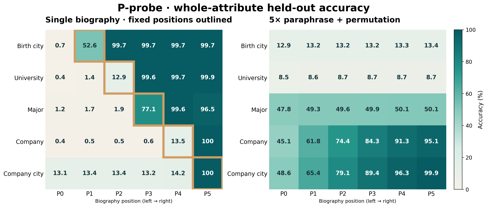

<div align="center">
  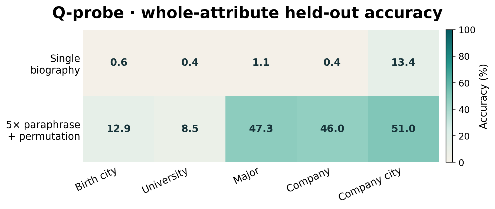
</div>

> **Two results need explaining.** First, augmentation makes first tokens almost perfectly readable
> from a name in this MoE, yet complete values remain far below the dense reference. Second, within
> the MoE P-whole matrix, only company and company-city rise sharply as P moves through the
> biography; birth city, university, and major barely move.

### 🔬 Mechanism diagnostics

#### 📐 Related facts follow exposure position

The second pattern is relation-specific: company and company-city become readable as the biography
advances, while the other three whole attributes stay nearly flat. This analysis trains no new model
or probe; it fits the completed held-out P-whole measurements.

The relationship is built into the profile generator. There are 263 company candidates and 200
company-city candidates. Every company has one fixed city; 171 cities have one candidate company,
28 have two, and New York has 36. Thus a company identifies its city exactly, while a city narrows
the company to an average of 1.315 candidates (and is much less specific for New York). Each person
samples a company uniformly, then receives that company's city.

The six biography sentences are independently permuted. At P position $j$, the probability that at
least one of the two related fields has already appeared is:

$$
\Pr(\text{either related field appears before } P_j)
= 1 - \frac{\binom{4}{j}}{\binom{6}{j}}.
$$

For P0 through P5, this is 0, 1/3, 3/5, 4/5, 14/15, 1. We fit each observed curve against
that probability.

| Target | Fitted baseline | Saturation | RMSE | $R^2$ |
|---|---:|---:|---:|---:|
| Company | 45.06% | 94.59% | 0.311 pp | **0.99968** |
| Company city | 48.44% | 99.72% | 0.097 pp | **0.99997** |

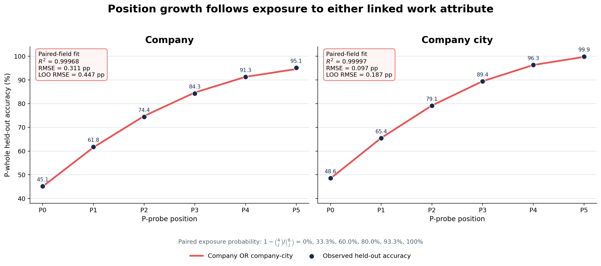

Company rises from 45.13% to 95.09%, and company-city from 48.56% to 99.86%. The paired-field fit
reconstructs all six positions within 0.1–0.3 percentage points ($R^2=0.99968$ and $0.99997$).
**These readouts track whether the biography has already exposed one side of the company–city
relation, rather than simply benefiting from a later position. In representation, the two fields
behave as a bidirectional association: seeing either makes the other easier to read out. This does
not establish a fixed causal direction for any individual example.**

#### 🧭 Token-conditioned MoE routes

This is inference-only: the backbone is frozen, no probe embedding delta is applied, and no
classifier is trained. From the person-held-out split it selects 162,044 augmented cases where
Q-first is correct, Q-whole is wrong, and the true value has at least two tokens. The exact cached
`t1` and `t2` are appended after the name, and the top-2 expert choices are recorded at both token
positions for all 12 layers.

Pairs share the same attribute and `t1`. Same-`t2` pairs form the control; different-`t2` pairs form
the branch condition. The analysis compares how route Jaccard overlap changes from `t1` to `t2`,
using seed 1337 and at most 2,000 sampled pairs per eligible group. All 12 layer-level
difference-in-differences are positive; the largest is **0.676**, with the strongest branching in
the early layers.

At each MoE layer, a token route is the set of its top-2 selected experts. For an attribute/layer
group $g$ with sampled pair set $\mathcal{P}_g$, route overlap is the mean expert-set Jaccard
similarity:

$$
J_g(t) = \frac{1}{\lvert \mathcal{P}_g \rvert}
\sum_{(a,b) \in \mathcal{P}_g}
\frac{\lvert E_a(t) \cap E_b(t) \rvert}{\lvert E_a(t) \cup E_b(t) \rvert},
\qquad
\mathrm{branching}_g = J_g(t_1) - J_g(t_2).
$$

$$
\mathrm{DiD} = \mathrm{branching}_{\mathrm{different}\ t_2} - \mathrm{branching}_{\mathrm{same}\ t_2} = [J_{\mathrm{different}}(t_1) - J_{\mathrm{different}}(t_2)] - [J_{\mathrm{same}}(t_1) - J_{\mathrm{same}}(t_2)].
$$

The same-`t2` group controls for route changes that occur even when the next token is unchanged. A
positive DiD means that examples with different `t2` values lose more route overlap after `t2` than
the matched control. Each heatmap cell applies this calculation within one attribute and one layer;
layer-level summaries are pair-count weighted across attributes.

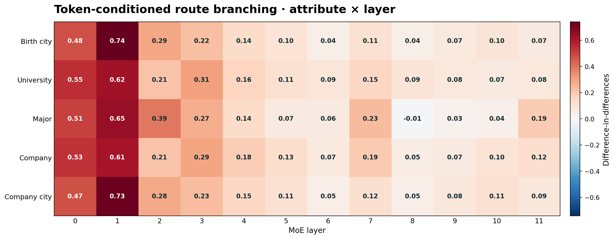

**This is where the dense and MoE extraction layouts begin to differ.** In the augmented dense
reference, a name-only state makes the complete attribute nearly linearly readable. Here, the name
opens a shared first-token entry, but it does not expose the complete biography fact in one readout;
after `t1`, different `t2` values take measurably different top-2 routes. The resulting picture is
more conditional: a shared entry can be followed by token-specific retrieval branches.

**This is consistent with a more finely factorized form of knowledge storage and extraction:** a
common prefix can be reused while many continuations remain separate. That gives the MoE a larger
conditional storage/extraction space than a single flat name-to-value direction. This is an
interpretation of the route and probe results—not a direct measurement of compression, nor evidence
that an individual expert physically stores one fact.

### 🧷 P-first token intervention

This asks a simple follow-up question: once the earlier P-first classifier has produced `t1`, does
that token make the rest of the value easier to read? For every P0–P5 prefix, we take the aligned
P-first classifier output from the formal cache, decode it to its leading-space GPT-2 token, check
the round trip, and append it to the same prefix. The backbone stays frozen; the new P-whole probe
reads the hidden state at the appended `t1`.

For the same profile above, one `multi5_permute` biography ends with the company city:

```text
In particular, Jonah15 Blair13 Carter36 studied at Chicago8 University.
Historically, He had a professional role at Brooks9 Group.
Public records show He grew up in Tacoma9, NC.
Biographical notes say He was born on October 24, 2046.
Notably, He majored in Political Science2.
He worked in Albany3, GA.

ordinary P-whole
prefix ending in "He worked in" ──> [read before " Albany3, GA"] ──> fresh whole-value classifier

P-first-token P-whole
the same prefix ──> [P-first classifier outputs " Albany3"] ──> [append and read that token]
                ──> fresh whole-value classifier
```

<!-- A new P-whole head is trained after the intervention. It is separate from the earlier P-first
classifier; that classifier is not reused as the whole-value readout. -->

A fresh P-whole probe then trains on that state using the same rank-2 embedding-delta + LayerNorm +
classifier architecture, person split, whole-value class mapping, and seed 1337. Each of the five
whole attributes uses 4,000 steps with batch 128; validation uses batch 3,072. The formal no-`t1`
baseline used the original pre-attribute state and a 12,000-step rank-2 head.

**The recovery follows the retrieval layout, not a generic single-versus-augmentation comparison.**
In fixed-order `single`, the useful states are the five diagonal positions immediately before each
attribute's own sentence; that diagonal recovers from **51.21% to 94.09%**. In
`multi5_permute`, the first-token entry works at every source position, so the complete 30-cell
P-whole matrix recovers from **45.28% to 96.38%**.

| Layout | Readout region | Formal no-`t1` | P-whole after P-first `t1` |
|---|---|---:|---:|
| `single` | Five fixed source positions (diagonal) | 51.21% | **94.09%** |
| `multi5_permute` | All 30 position × attribute cells | 45.28% | **96.38%** |

Each figure compares the original formal whole probe with a fresh probe after P-first `t1` is
appended. In `single`, read the diagonal; in `multi5_permute`, read the full matrix.

#### `single`

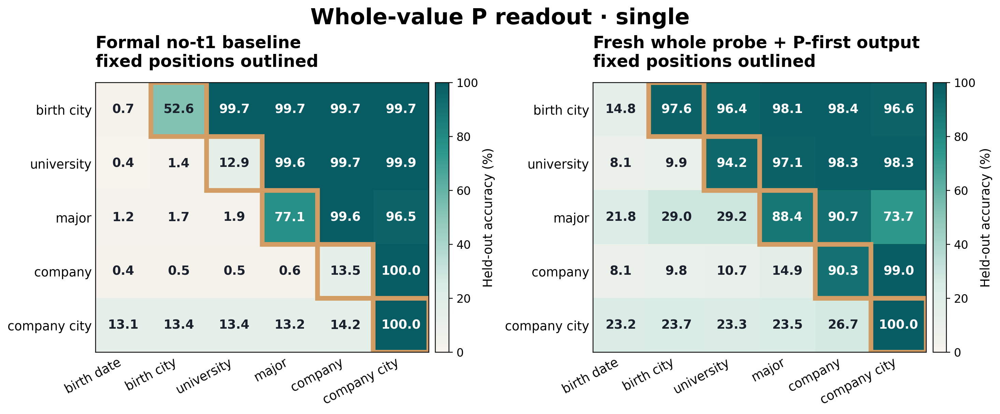

#### `multi5_permute`

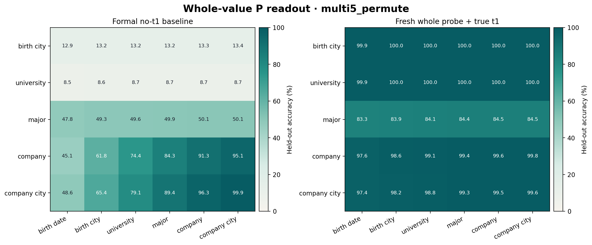

#### 🧩 Attribute-token retrieval structure

The P-first-token intervention closes the mechanism picture for this setting. The P/Q readouts
show **what** is linearly available at each point; the route analysis shows that the continuation
changes with the next token; and this intervention shows that supplying the classifier-produced
first token restores the corresponding whole-value readout. Together, they identify a complete
retrieval sequence: a shared entry into an attribute, followed by token-conditioned extraction of
the remaining value.

That is more structured than the dense reference, where the augmented name state can make an
entire value linearly readable in one step. Here, the name reliably opens the first-token entry,
but later tokens are recovered through their own conditional continuations:

```text
single:
name → fixed biography position → attᵢ: t₁ → t₂ → …

augmentation (`multi5_permute`):
                  ┌→ att₁: t₁ → t₂ → …
                  ├→ att₂: t₁ → t₂ → …
           name ──┼→ att₃: t₁ → t₂ → …
                  ├→ …
                  └→ attᵢ: t₁ → t₂ → …
```

The arrows summarize the retrieval sequence observed by the probes. They are not literal memory
pointers or evidence that one expert stores one fact.

#### 🧬 Pretraining implication: teach components, not only templates

A pattern that always appears as one fixed sequence may be learned as one conditioned retrieval
path. For example, suppose the pretraining corpus repeatedly contains only:

```python
value = normalize(parse(load(path)))
```

If `load`, `parse`, and `normalize` must later work independently or in new combinations, repeating
the complete expression is not enough. The corpus should also expose the intermediate operations,
alternative inputs, and new compositions:

```python
raw = load(path)
record = parse(raw)
value = normalize(record)

preview = parse(buffer)
score = normalize(measurement)
```

Allen-Zhu's dense-model result made some complete attributes directly readable from a name-only
state. Here, augmentation makes the first token directly readable, but not the whole value.
The contrast is in how the value is retrieved. The dense reference can read a complete attribute
through one shared name-to-value direction. In this MoE, the name state opens `t1`; the token at
that entry then conditions the route used to recover `t2` and the remaining value.

The route DiD provides the corresponding evidence: after matched examples share `t1`, their top-2
routes separate more for different `t2` values than for the same-`t2` control. In that sense, the
MoE behaves like a gated chain of retrieval operators rather than a flat whole-value readout at the
name state.

**The resulting retrieval layout is sequential:** augmentation gives a name a direct handle on an
attribute's first token, while recovering the rest of that value is a second, token-conditioned
stage. Once `t1` is available, the route taken by the MoE changes with the next token.

One way to view the difference is through the readout space. In the dense reference, a linear head
can recover a complete value directly from the name-only state. In this MoE, that state exposes the
first token, while the later tokens become readable only after the corresponding conditional route
has been taken. The distinction is therefore in the retrieval structure, not in a larger hidden
dimension or a literal tensor-product representation.

For pretraining data, the practical consequence is simple: **a capability that must later be addressed or
recombined independently should appear in decomposed and substituted forms during training, not
only inside one repeated end-to-end template.** Such variation gives the model distinct entry points
from which routing can retrieve the required component.

<a id="quick-start"></a>

## 🚀 Quick start

MiniTrainSys supports Python 3.10–3.12. Create an environment:

```bash
python -m venv .venv
# Linux / macOS
source .venv/bin/activate
```

```powershell
# Windows PowerShell
.\.venv\Scripts\Activate.ps1
```

Install the CPU development stack:

```bash
python -m pip install -e ".[data,dev]"
```

Run the smallest complete training loop on CPU:

```bash
python scripts/train.py \
  --config configs/train_debug.yaml \
  --model-config configs/model_debug_dense.yaml \
  --device cpu
```

Then continue with [single-GPU, FSDP, and interpretability workflows](#training-workflows), or read
the [project walkthrough](docs/guides/project_walkthrough.md). Triton is only needed for the
Linux/x86_64 GPU workflow and is installed by the server setup path below.

<a id="reproducibility"></a>

## 📊 Reproducibility and evidence

Large mutable artifacts live on the data disk; Git stores compact, auditable evidence:

```text
artifacts/ → /data/mini-train-sys/artifacts/   datasets, checkpoints, logs, raw runs

results/                                       Git-safe evidence
├── benchmarks/                               raw cases, aggregates, figures
├── datasets/                                 manifests, lineage, checksums
├── formal_runs/                              metrics, events, summaries
├── logs/                                     benchmark, experiment, validation logs
├── notebooks/                                executed benchmark notebooks
├── tensorboard/index.csv                     TensorBoard ownership index
├── catalog/artifacts.json                    exported-file catalog
├── catalog/retention.json                    retained large-artifact catalog
└── MANIFEST.sha256                           snapshot integrity

reports/                                       long-form engineering and research reports
```

Raw biographies, token caches, model weights, optimizer/DCP shards, and large per-example route
records remain under `/data`. Git records their logical location, size, category, retention state,
and available hashes.

After every benchmark or validation cycle:

```bash
bash scripts/bash/export_test_results.sh
sha256sum --quiet -c results/MANIFEST.sha256
```

Cross-experiment headline metrics live in
[`results/BENCHMARK_SUMMARY.md`](results/BENCHMARK_SUMMARY.md). Exact commands and lifecycle records,
including failed and stopped runs, are retained under [`results/logs/`](results/logs/).

<a id="project-structure"></a>

## 🗂️ Project structure

```text
minitrain/
├── data/          document sources, token shards, mmap datasets, samplers
├── model/         Transformer, attention, Dense/MoE blocks
├── kernels/       PyTorch reference, Triton kernels, CUDA extension
├── distributed/   single, DDP, and FSDP strategy adapters
├── train/         steps, optimizer, LR, clipping, checkpoint state
└── runtime/       config, factories, devices, logging

experiments/       SynBioS data generation, cloze evaluation, probes, route analysis
configs/           composable model/data/strategy/hardware/run YAML
scripts/           training, benchmarking, export, and server entry points
tests/             executable benchmark notebooks, runners, and shared utilities
reports/           engineering and experiment reports
results/           versioned machine-readable evidence
```

<a id="data-and-configuration"></a>

## 📦 Data and configuration

### Data preparation and loading

The training stack accepts three data sources. `random` is useful for smoke tests before a corpus
exists; `tokens` reads a small legacy token file (`.pt`, `.pth`, `.npy`, or `.bin`); and
`token_shards` is the scalable path used for real corpora.

| Data source | Input | Typical use |
|---|---|---|
| `random` | Seeded synthetic token IDs | Debugging the model, kernels, and distributed loop |
| `tokens` | One token file in memory | Small experiments and compatibility data |
| `token_shards` | `manifest.json` plus binary shard files | Reusable, large-corpus training |

### Building a token-shard corpus

`scripts/prepare_data.py` separates tokenizer creation from corpus tokenization, so a tokenizer
can be trained once and reused across corpora. It reads `.txt`, `.text`, `.md`, `.jsonl`,
`.jsonlines`, and `.parquet`; JSONL and Parquet use `text` by default, or another field selected
with `--text-field`.

Choose either tokenizer route:

```bash
# Train a byte-level BPE tokenizer on your own text.
python scripts/prepare_data.py train-tokenizer raw_docs \
  --output artifacts/my_tokenizer --vocab-size 32768

# Or record a named, existing tiktoken encoding for reuse.
python scripts/prepare_data.py use-tiktoken \
  --encoding gpt2 --output artifacts/gpt2_tokenizer
```

Then tokenize any corpus with that recorded artifact:

```bash
python scripts/prepare_data.py tokenize raw_docs \
  --tokenizer artifacts/my_tokenizer \
  --output artifacts/my_corpus
```

Preparation normalizes and filters text by default, applies exact-deduplication, splits documents
deterministically into train/validation, and chunks very long documents at natural boundaries.
Cleaning, document-size, split, and shard-size limits are all CLI options. The resulting directory
has this layout:

```text
raw documents
  → recorded tokenizer artifact
  → bounded token shards
  → documents.idx + manifest.json
```

- **Token shards** hold the token stream in bounded files.
- **`documents.idx`** stores each document's token `(offset, length)`, so documents can be found
  without parsing the source again.
- **The manifest** records the tokenizer fingerprint, vocabulary/storage format, split and
  cleaning settings, shard paths, token counts, sizes, and hashes.

`python scripts/prepare_data.py inspect artifacts/my_corpus` prints that manifest. Put its
fingerprint in `data.tokenizer_fingerprint` to reject a tokenizer/corpus mismatch before training.

Training uses `data.source: token_shards` and opens the shard files with `mmap`; the full corpus is
not copied into RAM. Each worker keeps only a bounded LRU of open shard mappings. The loader
supports two packing modes:

| Packing mode | Behavior |
|---|---|
| `contiguous` | Read fixed-length blocks from the token stream; used for ordinary token-shard training. |
| `randomized_documents` | Reorder complete documents at each epoch, then pack them into fixed-length blocks; used by the SynBioS experiment. |

`randomized_documents` changes only the logical order: it uses `documents.idx` to locate document
spans and does not rewrite the shard files. In distributed runs, each rank receives a disjoint,
equal-length block sequence. `set_epoch(epoch)` changes the order deterministically, so reruns with
the same seed match. When CUDA is used, DataLoader batches use pinned CPU memory and non-blocking
H2D copies. `num_workers: null` derives a per-rank worker count from `worker_budget` and
`max_workers_per_rank`.

Start from [`configs/data_token_shards_example.yaml`](configs/data_token_shards_example.yaml) for
the complete data-loader configuration, including shuffle, worker, prefetch, memory-pinning, and
drop-last controls.

### Configuration

Commands use two YAML files:

```bash
python scripts/train.py \
  --model-config configs/synbios_moe/model.yaml \
  --config configs/synbios_moe/runs/single_fsdp_4gpu.yaml \
  --device cuda
```

The model YAML defines the network. The run YAML selects the dataset, backend, optimizer, parallel
strategy, logging, and checkpoint policy. Run YAML files can use `extends`; `expected_world_size`
guards multi-GPU configurations from being launched with the wrong number of ranks.

<details>
<summary><strong>Formal 293M SynBioS MoE configuration</strong></summary>

| Model setting | Value |
|---|---|
| Architecture | Decoder-only Transformer, RoPE, tied input/output embeddings |
| Total / token-active parameters | 293,494,272 / approximately 123.62M |
| Layers / hidden size / heads | 12 / 768 / 12 |
| Sequence length | 512 |
| FFN | 8 experts, top-2, SwiGLU, expert intermediate size 1,024 |
| Router | Dropless, auxiliary coefficient 0.01, z-loss coefficient 0.001 |
| Dropout | 0.1 |
| Backend | Switchable PyTorch / Triton / CUDA |

| Run setting | Value |
|---|---|
| Parallelism | 4-GPU FSDP full shard, Transformer-block auto wrap |
| Precision | BF16, no GradScaler |
| Batch | Local 112/GPU, global 448, 229,376 tokens/step |
| Gradient accumulation | None |
| Optimizer | AdamW with μP-style parameter groups |
| Learning rate | Peak `1e-3`, 1,000-step warmup, cosine decay, floor `1e-4` |
| Stability | Global gradient-norm clip 5.0, fail immediately on NaN/Inf |
| Packing | Randomized documents, shuffle window 1,024 |

</details>

<a id="training-workflows"></a>

## 🛠️ Training workflows

MiniTrainSys supports Python 3.10–3.12. After completing the [Quick Start](#quick-start), use the
following entry points for GPU and distributed runs.

Validated Linux/NVIDIA server setup:

```bash
bash scripts/bash/setup_storage.sh /data
bash scripts/bash/setup_server.sh
```

Single-GPU CUDA training:

```bash
python scripts/train.py \
  --device cuda \
  --config configs/server/rtx4090_24gb/runs/single_1gpu.yaml \
  --model-config configs/model_125m_moe.yaml
```

Four-GPU FSDP:

```bash
NPROC=4 MODEL_CONFIG=configs/model_125m_moe.yaml \
  bash scripts/bash/distributed.sh fsdp
```

SynBioS training:

```bash
NPROC=4 bash scripts/bash/synbios_moe.sh single fsdp
NPROC=4 bash scripts/bash/synbios_moe.sh multi5_permute fsdp
```

Resume from the safety anchor:

```bash
RESUME=safety NPROC=4 bash scripts/bash/synbios_moe.sh single fsdp
```

Formal probing requires a batch recommendation produced by a completed probe-capacity benchmark:

```bash
STAGE=formal NPROC=4 PROBE_GPUS=4 \
PROBE_BATCH_ENV=<recommended.env> \
  bash scripts/bash/synbios_probes.sh multi5_permute fsdp latest
```

TensorBoard:

```bash
tensorboard --logdir artifacts/runs --host 0.0.0.0 --port 6006
```

### Static validation

```bash
ruff check .
```

<a id="reliability"></a>

## 🛡️ Reliability and recovery

Performance is never treated as proof of correctness. Formal runs require operator parity, training
smokes, distributed checkpoint validation, and multi-step stability at the selected batch.

Each logged point is aggregated across the full logging interval and then across ranks:

| Metric | What it shows |
|---|---|
| `loss/lm_cross_entropy` | Pure next-token loss without router regularization |
| `loss/moe_regularization_total` | Weighted auxiliary and z losses |
| `loss/total` | Actual loss used by backward |
| `tokens_per_sec`, `step_time_ms` | System throughput and complete step latency |
| `data_wait_ms` | Detect DataLoader bottlenecks |
| `gpu_compute_utilization_*` | Per-rank NVML compute utilization |
| `gpu_memory_*_percent_max` | Worst-rank current, reserved, and interval-peak memory |
| `grad_norm`, `grad_clip_fraction` | Early signs of excessive LR or numerical instability |
| `expert_load_cv`, `dead_expert_count` | MoE load balance |

MoE monitoring also records layer-by-expert top-k load and complete router probability heatmaps with
a fixed color scale.

FSDP model and Adam states are distributed, so training checkpoints use DCP rather than a rank-0
`state_dict()`. Evaluation and probing load a consolidated `model.pt`, avoiding the training
optimizer state. `--resume latest` selects only committed checkpoints; `--resume safety` bypasses
the most recent checkpoints when manual rollback is needed.

<a id="documentation"></a>

## 📚 Documentation

Use the [project walkthrough](docs/guides/project_walkthrough.md) for a guided tour, the
[architecture guide](docs/guides/architecture.md) for component boundaries, and the
[artifact layout contract](docs/guides/artifact_layout.md) for reproducibility rules.

### Executable notebooks and entry points

| Entry point | What it runs |
|---|---|
| `tests/example_training.ipynb` | Minimal model, LR, and checkpoint experiment |
| `tests/synbios_moe_end_to_end.ipynb` | Small data → training → evaluation → probe → route loop |
| `tests/operator_bench_linux_server.ipynb` | RTX 4090 Dense/Transformer kernel benchmark |
| `tests/moe_operator_bench_linux_server.ipynb` | Isolated router and fused-MoE benchmark |
| `tests/distributed_server_benchmark.ipynb` | Single/DDP/FSDP scaling and capacity |
| `scripts/bash/synbios_backend_benchmark.sh` | 293M MoE equal-batch and equal-memory backend comparison |

For deeper implementation and evidence:

- [Kernel engineering report](reports/engineering/kernels.md)
- [FSDP and end-to-end report](reports/engineering/distributed_training.md)
- [SynBioS evidence map](reports/synbios_moe/README.md)
- [Artifact layout contract](docs/guides/artifact_layout.md)
- [Project walkthrough](docs/guides/project_walkthrough.md)

<a id="references"></a>

## 📖 References and upstream work

MiniTrainSys is written and integrated in this repository, but it is deliberately explicit about the
projects, implementations, and research that informed it. “Adapted” below means source-derived code
is present in this repository; license notices are retained beside that code.

| Reference | Relationship to MiniTrainSys |
|---|---|
| [PyTorch](https://pytorch.org/) · [FSDP](https://docs.pytorch.org/docs/stable/fsdp.html) · [Distributed Checkpoint](https://docs.pytorch.org/docs/stable/distributed.checkpoint.html) | Tensor/autograd runtime, distributed primitives, FSDP, and DCP APIs. |
| [OpenAI Triton](https://triton-lang.org/) · [Fused Attention tutorial](https://triton-lang.org/main/getting-started/tutorials/06-fused-attention.html) · [Fused Softmax tutorial](https://triton-lang.org/main/getting-started/tutorials/02-fused-softmax.html) | Triton language and the main algorithmic references for the local attention and row-reduction kernels. |
| [FlashAttention](https://github.com/Dao-AILab/flash-attention) · [FlashAttention-2](https://arxiv.org/abs/2307.08691) · [CUTLASS](https://github.com/NVIDIA/cutlass) | The native CUDA attention extension adapts the upstream FlashAttention 2.8.4 source and builds against CUTLASS; their notices are retained under `minitrain/kernels/cuda_ext/csrc/third_party/`. |
| [Liger Kernel](https://github.com/linkedin/Liger-Kernel) | The fused MoE implementation is adapted from Liger Kernel under BSD-2-Clause; see `minitrain/kernels/triton/THIRD_PARTY_NOTICES`. Its RMSNorm, RoPE, SwiGLU, and fused-loss work also informed operator design. |
| [nanoGPT](https://github.com/karpathy/nanoGPT) · [nanochat](https://github.com/karpathy/nanochat) | Compact, script-first training-system references. |
| [TorchTitan](https://github.com/pytorch/torchtitan) · [Megatron-LM](https://github.com/NVIDIA/Megatron-LM) · [DeepSpeed](https://github.com/microsoft/DeepSpeed) | References for separating model code, runtime/configuration, distributed execution, optimizer state, and low-level extensions. |
| [Megatron-Core MoE](https://docs.nvidia.com/megatron-core/developer-guide/latest/api-guide/moe.html) · [vLLM](https://github.com/vllm-project/vllm) · [SGLang](https://github.com/sgl-project/sglang) | References for treating Top-K selection, token dispatch, grouped expert execution, and combination as distinct stages. |
| [NCCL documentation](https://docs.nvidia.com/deeplearning/nccl/user-guide/docs/index.html) | Collective-communication semantics and operational tuning reference. |
| [FineWeb](https://huggingface.co/datasets/HuggingFaceFW/fineweb) · [tiktoken](https://github.com/openai/tiktoken) | References for corpus/tokenization workflow and recorded tokenizer identity. |
| [Allen-Zhu & Li, *Physics of Language Models: Part 3.1*](https://arxiv.org/abs/2309.14316) · [project page](https://physics.allen-zhu.com/part-3-knowledge/part-3-1) | The SynBioS factual-recall setup and the P/Q probing distinction. This repository studies the corresponding mechanism in sparse MoE; it is not a claim of a strict dense-model reproduction. |

The repository-level [reference map](docs/references/reference_map.md) records how the system-level
references influenced individual boundaries; [references.md](docs/references/references.md) is the
shorter source index.

## 📄 License

MiniTrainSys is released under the [MIT License](LICENSE). Third-party CUDA, FlashAttention, and
CUTLASS sources retain their respective upstream licenses.
