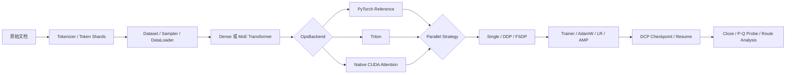
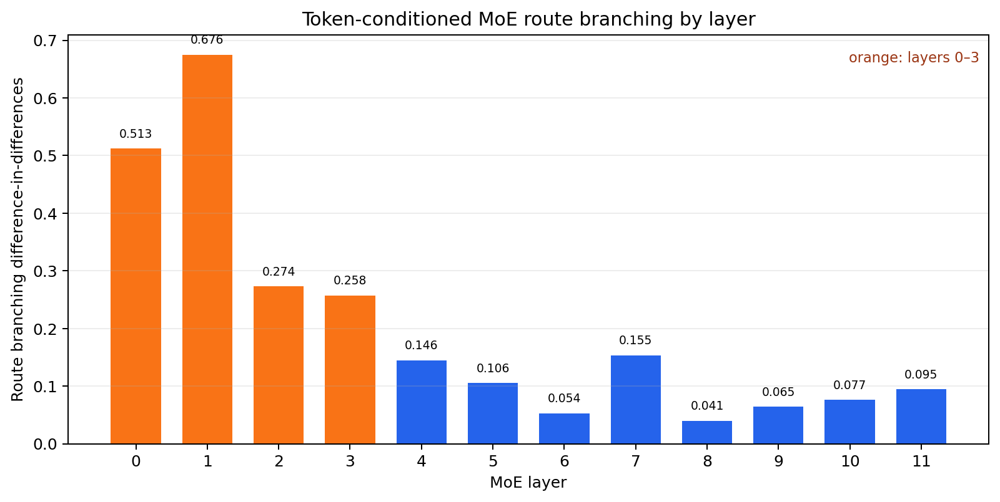

<div align="center">


# MiniTrainSys

**一个可以真正跑完训练、替换算子、做分布式 benchmark，也能继续研究模型内部知识表示的
小型 LLM 系统。**

`293M MoE` · `4×RTX 4090` · `Torch / Triton / CUDA` · `FSDP` · `SynBioS Probe`

</div>

---

## 目录

- [结果概览](#先看结果)
- [分层训练框架](#训练框架是怎样拆开的)
- [数据、配置与一次训练 step](#数据配置与一次训练-step)
- [Kernel 优化](#-kernel-优化)
- [端到端吞吐与显存](#-单算子收益能否落到端到端训练)
- [FSDP 扩展与 batch 决策](#fsdp-扩展是否充分)
- [正确性、监控与恢复](#正确性监控与恢复)
- [SynBioS 正式训练](#-synbios模型记住以后知识从哪里读出来)
- [P/Q Probe 与 Allen-Zhu 对照](#probe-结果什么复刻了什么没有)
- [MoE 路径式读取分析](#一种与结果一致的路径式读取模型)
- [结果归档与复现](#结果怎样保存)
- [安装与运行](#安装与运行)

---

## 先看结果

我做这个项目时主要想回答两个问题：

1. 把 PyTorch 的通用算子换成针对实际 workload 优化的 Triton/CUDA kernel，单算子的收益
   最后能不能真正落到端到端训练上？
2. 模型已经记住一批事实以后，这些事实到底怎样出现在 hidden state 里？稀疏 MoE 的知识
   读取方式会不会和 Allen-Zhu 实验中的 dense model 不一样？

目前最重要的结果如下：

| 部分 | 结果 |
|---|---:|
| Transformer/MoE 单算子 | 完整 forward+backward **1.22–6.51×** 加速 |
| 最大单算子显存收益 | Fused Linear Cross Entropy 峰值 allocation **降低 94.0%** |
| 同 batch 端到端训练 | CUDA backend 的 token 吞吐为 Torch 的 **1.456×** |
| 同显存预算端到端训练 | local batch 扩大 4×，token 吞吐达到 **2.201×** |
| FSDP 1→4 卡弱扩展 | **3.69×**，并行效率 **92.24%** |
| 增强语料的 name-only Q-first | **98.79%**，固定顺序 single 只有 12.83% |
| 增强语料的 P0-first | **98.63%**，固定顺序 single 只有 6.76% |
| 给定正确 `t1` 后的 multi5 P-whole | **45.28% → 96.38%** |

所有服务器结果来自同一台 4×RTX 4090 24 GB 机器，软件环境为 PyTorch 2.5.1+cu118、
CUDA 11.8 和 Triton 3.1。仓库保留的不只是最后几张图，还包括 raw JSON/CSV、TensorBoard
events、数据 manifest、checkpoint 身份、OOM 边界、运行命令和失败记录。

---

## 训练框架是怎样拆开的

这个仓库不是把所有逻辑塞进一个 `train.py`。模型结构、算子 backend、分布式策略和训练状态
会因为不同原因变化，所以我把它们拆成了可以独立维护和测试的层：


```mermaid
flowchart LR
    A[原始文档] --> B[Tokenizer / Token Shards]
    B --> C[Dataset / Sampler / DataLoader]
    C --> D[Dense 或 MoE Transformer]
    D --> E{OpsBackend}
    E --> F[PyTorch Reference]
    E --> G[Triton]
    E --> H[Native CUDA Attention]
    F --> I{Parallel Strategy}
    G --> I
    H --> I
    I --> J[Single / DDP / FSDP]
    J --> K[Trainer / AdamW / LR / AMP]
    K --> L[DCP Checkpoint / Resume]
    L --> M[Cloze / P-Q Probe / Route Analysis]
```

这里最关键的边界是 `OpsBackend`。Transformer block 只声明自己需要 RMSNorm、RoPE、
attention、SwiGLU、loss、router 或 MoE 计算，不关心最终由 Torch、Triton 还是 CUDA
实现。不支持的 shape 也通过同一接口回退，不需要在模型里到处写 backend 分支。

分布式也采用相同思路。Trainer 只负责一次普通的 optimizer step，strategy 决定模型是否
由 DDP 或 FSDP 包装。这样可以先在单卡验证 kernel 数值，再用 tiny model 检查
checkpoint，最后才组合成正式四卡训练；不必每改一个算子就启动完整实验。

| 层 | 负责什么 | 可以单独替换什么 | 主要检查 |
|---|---|---|---|
| `minitrain/data` | 文档、token shard、mmap dataset、sampler | tokenizer、shard 格式、worker | 顺序、覆盖率、split 身份 |
| `minitrain/model` | attention、Dense/MoE block、logits | Dense 或 top-k MoE 结构 | shape、dtype、causal 语义 |
| `minitrain/kernels` | `OpsBackend` 后面的算子实现 | Torch、Triton、CUDA、fallback | forward/backward parity |
| `minitrain/distributed` | 进程组和模型包装生命周期 | single、DDP、FSDP | 多进程 smoke、扩展效率 |
| `minitrain/train` | optimizer step 和训练状态 | 参数组、LR、clipping、AMP | loss、梯度、恢复连续性 |
| `minitrain/runtime` | typed config、factory、日志 | 设备与组件选择 | 配置解析、监控输出 |
| `experiments/synbios_moe` | 数据生成和冻结模型分析 | cloze、P/Q、route 诊断 | hash、split、协议门禁 |

### 一次正式训练怎样进入服务器

正式训练不会从“代码能 import”直接跳到四卡：

1. 先跑完整 regression；
2. 分别验证 Torch/Triton 算子的 forward 和 backward；
3. 跑短 single/DDP/FSDP training smoke；
4. 验证 FSDP checkpoint save/resume；
5. 在候选 batch 上做多 step 稳定性和容量测试；
6. 最后选择**吞吐最高**且显存安全的 batch 写回 YAML。

Checkpoint 会保存模型、AdamW、scheduler、AMP scaler、trainer counters、每个 rank 的
RNG、精度和完整 resolved config。FSDP 使用 distributed checkpoint shards 和
`COMMITTED` 标记；进程中断留下的临时目录不会被误认为可恢复 checkpoint。

SynBioS 正式训练保留最近两个恢复点，再保留一个低频 safety anchor。这样既能把异常后的
回滚控制在几分钟内，也不会每个 epoch 都停下来写完整 Adam 状态。

---

## 数据、配置与一次训练 step

### 数据不会整份搬进内存

通用预处理入口把文档编码成 mmap token shards，并写出包含 tokenizer、token 数、文档
边界、文件大小和 SHA256 的 manifest。训练时 DataLoader 只读取当前 block；正式 SynBioS
使用 `randomized_documents`，每个 epoch 先确定性地重排完整文档，再打包成固定长度
sequence。不同 rank 从同一全局顺序取得互不重叠的样本。

```text
documents.jsonl
  ├── exact character spans / metadata
  ├── tokenizer identity
  └── token shards + documents.idx + manifest
          ↓
  deterministic epoch permutation
          ↓
  rank-disjoint fixed-length blocks
          ↓
  pinned-memory non-blocking H2D
```

`num_workers: null` 会按照节点 CPU 总预算自动分配 worker：先给四个 trainer rank 留出 CPU，
再限制每 rank 的 worker 上限。正式训练最终每 rank 使用 4 workers，data wait 只有 0.10%，
说明继续增加 worker 对吞吐没有实际帮助。

所有数据条件都拥有独立目录和 manifest。派生出的 Probe cache 还会记录 parent manifest
hash、person split、class mapping 和 token coverage；不同 seed、protocol 或 tokenizer
不会静默共用同一个 cache。

### Model YAML 与 run YAML 分开

模型尺寸和运行策略的变化频率不同，因此命令同时接收两份配置：

```bash
python scripts/train.py \
  --model-config configs/synbios_moe/model.yaml \
  --config configs/synbios_moe/runs/single_fsdp_4gpu.yaml \
  --device cuda
```

Model YAML 只描述网络；run YAML 通过 `extends` 组合 dataset variant、optimizer、
parallel strategy、hardware topology、logging 和 checkpoint。所有字段最后转换为 typed
dataclass，拼错字段会在启动时失败，而不是被 YAML 静默忽略。`expected_world_size=4`
也会阻止四卡配置被误用成单卡或八卡任务。

正式 SynBioS 模型如下：

| 项目 | 配置 |
|---|---|
| 架构 | Decoder-only Transformer，RoPE，tied input/output embedding |
| 总参数 / token-active 参数 | 293,494,272 / 约 123.62M |
| Layers / hidden / heads | 12 / 768 / 12 |
| Sequence length | 512 |
| FFN | 8 experts，top-2，SwiGLU，expert intermediate 1,024 |
| Router | dropless；aux coef 0.01；z-loss coef 0.001 |
| Dropout | 0.1 |
| Backend | 可切换 Torch / Triton / CUDA |

正式优化配置：

| 项目 | 配置 |
|---|---|
| 并行 | 4-GPU FSDP full shard；Transformer-block auto wrap |
| 精度 | BF16，无 GradScaler |
| Batch | local 112/GPU；global 448；229,376 tokens/step |
| 梯度累计 | 无；一个 DataLoader batch 就是一个 optimizer update |
| Optimizer | AdamW；LLM parameter groups |
| LR | peak `1e-3`；1,000-step warmup；cosine decay；floor `1e-4` |
| 稳定性 | global grad-norm clip 5.0；NaN/Inf 立即失败 |
| Packing | randomized documents；shuffle window 1,024 |

### 一个 batch 经过哪些组件

```text
DataLoader CPU tensor
  → pinned-memory non-blocking H2D
  → BF16 autocast forward
  → LM cross entropy + MoE aux/z losses
  → backward
  → global gradient norm / clipping
  → AdamW step
  → zero_grad(set_to_none=True)
  → LR scheduler step
  → JSONL / TensorBoard / terminal aggregation
```

Optimizer 一定在分布式包装之后创建，避免 FSDP optimizer 持有错误的参数视图。Epoch 开头
sampler 调用 `set_epoch(epoch)`，因此每轮顺序变化但可复现。如果 `max_steps` 在 epoch
中间停止，该 epoch 不会被标记为完成；恢复后会从最后一个完整 epoch 边界重做。

---

## ⚡ Kernel 优化

### Benchmark 不是只测一个“好看”的 shape

单算子 benchmark 使用正式 293.49M MoE 的 shape；如果 Torch 基线在正式 shape OOM，
则使用所有实现都能运行的最大公共 shape 做速度比较，同时单独记录 fused 实现能达到的容量。

每个 case 都在新的 CUDA 子进程里运行，避免前一个 OOM 或 allocator 状态污染后面的显存值。
完整流程包括 warmup、CUDA synchronize、多个 repeat、P50/P95 full-step latency 和 peak
allocated memory。候选 kernel 必须先通过：

- forward / backward 对齐；
- BF16、FP16、FP32 和必要的 FP32 reduction；
- strided 或 boundary shape；
- ignored target、causal mask 等协议边界；
- unsupported shape 的 fallback。

代表性 workload 是 hidden 768、intermediate 1,024、head dim 64、vocab 50,257、
8 experts、top-2、BF16，单 rank 最多 57,344 tokens。


| 算子 | 实现重点 | 主要解决的问题 | Full-step 加速 | 峰值 allocation 降低 |
|---|---|---|---:|---:|
| RMSNorm | 每行一个 program，FP32 reduction，融合 normalize/scale | launch 和内存往返 | **6.51×** | **78.7%** |
| RoPE | token/head 分块，Q/K 共享 sin/cos 读取 | 小算子 launch、带宽 | **2.57×** | 14.3% |
| SwiGLU | 融合 SiLU、gate multiply 和 backward | 中间 activation | **1.42×** | 20.0% |
| Cross Entropy | 按 vocab block 做 online max/sum | vocab reduction、概率矩阵 | **4.54×** | **83.3%** |
| Fused Linear CE | 分块生成 logits，立即消费 dlogits | `[tokens,vocab]` activation | **1.39×** | **94.0%** |
| FlashAttention | Q/KV tile、online softmax、backward 重算 | attention I/O 和 saved tensor | **1.22×** | **44.1%** |
| Native CUDA Attention | 上游 FA template，只编译实际 shape bucket | 更底层的 attention 路径 | **1.15×** | 22.1% |
| Router postprocess | 融合 softmax/top-k/归一化/z-loss/stat | 多次重复扫 router row | **2.43×** | **65.2%** |
| Fused MoE | histogram/prefix scatter、expert GEMM、weighted gather | 不规则 dispatch | **1.46×** | 5.3% |

### RMSNorm：把一个公式收回到一次内存遍历

RMSNorm 的公式不复杂，但 Torch graph 会拆成 square、mean、rsqrt、normalize 和 scale
等多个通用 op。Triton 中每个 program 负责一行 hidden vector，用 FP32 累加平方和，
得到 reciprocal RMS 后直接乘 scale 并写回。Backward 沿用同一 row-parallel 布局，
scale gradient 使用单独的 partial reduction。

收益来自更少的 launch 和更少的 global-memory 往返，并不是改了数学定义。最终完整
forward+backward **加速 6.51×，allocation 降低 78.7%**，是单算子里最大的延迟收益。

### RoPE：小算子更需要减少 launch

RoPE 的瓶颈主要是带宽和 launch，而不是 FLOPs。kernel 在 batch×sequence×head 行上并行，
在成对的 head 坐标上 vectorize；Q/K 复用同一组 cosine/sine 读取。另有 strided path，
不会为了让 kernel 工作而强制调用方复制 contiguous tensor。

输出本身仍必须写回，所以显存只降低 14.3%；真正的收益是把多个小 elementwise kernel
合并以后取得 **2.57×** 加速。

### SwiGLU：不再落地 `silu(gate)`

一个 program 读取 gate/up tile，在 register 中计算 SiLU 和乘法，然后只写最终输出；
backward 在一次 pass 中生成 gate 和 up 两个分支的梯度。去掉 `silu(gate)` 中间张量后，
完整 step **加速 1.42×，显存降低 20.0%**。

### Cross Entropy：按词表流式归约

普通 CE 需要处理每个 token 的完整词表。Triton 实现按固定大小的 vocabulary block 流式
读取，用 online max/sum recurrence 算 log-sum-exp，不保存完整 probability matrix。
Backward 在私有 logits buffer 中写 `softmax - one_hot`，ignored targets 和 mean
normalization 也在 kernel 内完成。

最大公共 shape 上，结果为 **4.54× 加速和 83.3% allocation 降低**。

### Fused Linear Cross Entropy：避免最大的 LM-head activation

更大的问题不是 CE 本身，而是先把 `[tokens, vocab]` logits 完整生成出来。正式 shape 是
57,344×50,257，单个 logits activation 就非常大。

Fused Linear CE 把 workspace 限制在默认 64 MiB：

```text
hidden chunk → x @ Wᵀ → online CE → 立即消费 dlogits → 累加 dx / dW
```

每个 chunk 的梯度用完就释放，不让完整 sequence logits 常驻。最大公共比较点上峰值
allocation **降低 94.0%**，同时加速 **1.39×**。在 57,344-token 正式 shape 上，
fused 路径的 peak allocation delta 只有 356 MiB，而显式 Torch logits 对照无法完成。

### FlashAttention：Torch 基线本身就是官方 fused backend

这组结果最容易被误读，所以需要把基线说清楚。Torch backend 调用的是
`torch.nn.functional.scaled_dot_product_attention`；profiler 记录明确显示 BF16、
causal、head-dim 64 的 case 进入：

```text
aten::_scaled_dot_product_flash_attention
aten::_scaled_dot_product_flash_attention_backward
```

也就是说，对比对象不是朴素的 `QKᵀ → softmax → V`，而是 PyTorch 官方已经融合的
Flash-SDPA。

Triton 版本用 `BLOCK_M` 切 query row、`BLOCK_N` 切 key/value column，在片上维护 online
softmax 的 running max 和 normalizer；backward 通过重算减少 saved tensor，而不是保存
`N×N` attention matrix。Native CUDA backend 复用上游 FlashAttention launch template，
只编译本项目需要的 dtype、causal mode、SM target 和 head-dimension bucket。

三边都属于 flash algorithm，都没有物化二次方 attention matrix。在这个前提下，Triton
仍然比官方 fused Flash-SDPA **快 1.22×、allocation 低 44.1%**；native CUDA 路径
**快 1.15×、allocation 低 22.1%**。这部分收益来自正式 workload 的 shape specialization、
launch/workspace 行为和 saved-tensor 选择，不是因为选了一个弱 Torch baseline。

Profiler 原始派发证据保存在
[`torch_attention_backend.json`](results/benchmarks/operator_benchmark/resume_summary/torch_attention_backend.json)。

### Router：小矩阵也会被多次遍历拖慢

常规 router graph 会先 softmax，再 top-k，再归一化，还要计算 probability mean、z-loss
和 entropy。每个张量不算大，但会被重复读写很多次。

Triton program 以 token×expert row 为单位，把 FP32 softmax、迭代 top-k、selected-weight
normalization 和统计量放在一次 pass 中；backward 在同一逻辑中重建 softmax Jacobian。
结果是 **2.43× 加速和 65.2% allocation 降低**。

### Fused MoE：先把不规则路由变成规则 expert tile

MoE 路径先用 histogram 和 prefix sum 统计各 expert 收到的 token，再把 top-k route
scatter 到连续 expert tile。GEMM 的并行维度是：

- M：不同 expert 的 token tile；
- N：intermediate/hidden column。

随后做 expert-specific gate/up projection、fused SwiGLU、down projection，再按 route
weight gather 回 token 顺序。把不规则 dispatch 转换为规则 GEMM tile 后，完整 step
加速 **1.46×**。显存只降低 5.3%，因为该 shape 下 Torch storage 本来就比较紧凑；
这个 kernel 的主要目标本来就是吞吐，而不是制造一个夸张的显存数字。

---

## 🚀 单算子收益能否落到端到端训练

端到端测试固定同一个 12-layer、293,494,272 总参数、8-expert top-2 MoE。每个 token
实际激活约 123.62M 参数；所有 backend 都使用 BF16、sequence 512、AdamW 和四卡 FSDP。

### 相同工作量：local batch 24

| Backend | 吞吐 | 相对 Torch | Step P50 | Peak allocated/GPU |
|---|---:|---:|---:|---:|
| Torch | 147,879 ± 6,891 tok/s | 1.000× | 334.05 ms | 16,626 MB |
| Triton | 212,247 ± 1,843 tok/s | **1.435×** | 231.72 ms | 5,361 MB |
| CUDA | **215,368 ± 2,190 tok/s** | **1.456×** | **228.44 ms** | **5,358 MB** |

CUDA facade 只比 Triton 快 1.47%。这是合理的：CUDA-specific 路径主要是 attention，
端到端的大头来自 Triton/CUDA 共用的 fused MoE 和 loss stack。这里准确的说法是
“完整优化 backend 比 Torch 快 1.456×”，而不是“所有算子都必须手写 CUDA”。

### 显存节省要先扣掉网络权重

原始 peak 同时包含 weights、gradients、optimizer 和 FSDP state。如果直接把两个 peak
相减然后都叫 activation saving，会把静态状态也算进去。

这里对每个 backend 分别计算：

```text
peak_allocated(batch 24) - peak_allocated(batch 1)
```

| Backend | Batch 1→24 allocation 增量 | 每个新增 sample | 相对 Torch |
|---|---:|---:|---:|
| Torch | 14,981 MB | 651.37 MB | baseline |
| Triton | 3,949 MB | 171.69 MB | **−73.64%** |
| CUDA | 3,948 MB | 171.63 MB | **−73.65%** |

它仍然是 activation 的工程估计，不是逐 tensor 的 liveness proof，但至少不会把大家都有的
模型状态包装成显存优化。

### 相同显存预算：实际训练能获得什么

第二组测试给所有 backend 同一个规则：在 peak reserved 不超过约 92% 的前提下，选择
吞吐最高的 batch。

| Backend | 最佳 local/global batch | Peak reserved | 吞吐 | 相对 Torch |
|---|---:|---:|---:|---:|
| Torch | 24 / 96 | 85.27% | 160,149 tok/s | 1.000× |
| Triton | 96 / 384 | 81.85% | 349,965 tok/s | **2.185×** |
| CUDA | 96 / 384 | 81.78% | **352,544 tok/s** | **2.201×** |

优化 backend 在相同显存规则下容纳 4× local batch，最终吞吐超过 Torch 的两倍。
“同 batch”和“同显存”回答的是两个不同问题：前者更接近代码效率，后者是训练任务真正
能吃到的容量收益，因此两组结果都保留。


---

## FSDP 扩展是否充分

### 1→4 卡弱扩展

弱扩展固定 local batch 64、模型、精度、sequence length、warmup 和 measured steps：

| GPU | Local/global batch | 吞吐 | Scaling | Efficiency | Peak/GPU |
|---:|---:|---:|---:|---:|---:|
| 1 | 64 / 64 | 93,302 tok/s | 1.00× | 100.00% | 14,940 MB |
| 4 | 64 / 256 | **344,254 tok/s** | **3.69×** | **92.24%** | 12,413 MB |


两次四卡 repeat 分别是 92.08% 和 92.40%。Data wait 只有 0.10%，因此剩余 7.76% 主要符合
FSDP all-gather/reduce-scatter 和 PCIe `SYS` 拓扑上的同步成本。这台机器没有 NVLink。

对于当前单机目标，92.24% 已经说明并行较充分：正式训练记录区间平均 GPU compute
utilization 约 97%，瓶颈也不在 DataLoader。但这里不宣称跨节点扩展，更没有做过
expert-parallel benchmark。

### 最大可运行 batch 并不是最佳 batch

| Local/global batch | Peak allocated/GPU | 吞吐 | 决策 |
|---:|---:|---:|---|
| 96 / 384 | 74.56% | 365,034 tok/s | 安全 |
| **112 / 448** | **86.20%** | **370,857 tok/s** | 正式采用 |
| 120 / 480 | 92.02% | 281,926 tok/s | 能跑，但慢 24% |
| 128 / 512 | backward OOM | — | 容量边界 |

正式配置使用 local batch 112。Batch 120 虽然符合显存上限，但吞吐明显下降；如果只追求
“把显存吃满”，反而会选错配置。容量 sweep 的结论最终写进正式 YAML，而不是只留在
一次命令行 override 里。

---

## 正确性、监控与恢复

### 性能通过不代表数值正确

正式 FSDP 训练前使用的是两套独立门禁：

| 门禁 | 检查内容 |
|---|---|
| Operator parity | Torch vs Triton/CUDA forward、input/weight gradient、dtype、边界 shape |
| Single training smoke | loss、optimizer、scheduler、clip、logging 调用链 |
| DDP/FSDP smoke | 多进程初始化、跨 rank metric、完整 optimizer step |
| Checkpoint contract | 保存后恢复模型、Adam、LR、counter、RNG |
| Capacity stability | 目标 batch 连续多 step，无 NaN/Inf/OOM |
| Dataset audit | manifest hash、split overlap、shard gap/duplicate、class coverage |
| Formal identity | Git revision、dirty state、checkpoint、cache 和配置 hash |

当前完整 regression suite 为 **124/124 tests passed**。Kernel benchmark、formal training
和 Probe validation 不会用“跑得快”替代上述正确性检查。

### 训练时终端和 TensorBoard 看什么

每个日志点不是最后一个 batch 的瞬时值，而是整个 `log_interval` 在设备上累计后，再跨
rank 聚合。常用指标包括：

| 指标 | 用途 |
|---|---|
| `loss/lm_cross_entropy` | 不含 router 正则的纯 next-token loss |
| `loss/moe_regularization_total` | 加权 aux loss 与 z-loss |
| `loss/total` | 实际 backward 的总 loss |
| `tokens_per_sec` / `step_time_ms` | 全系统吞吐和完整 step 延迟 |
| `data_wait_ms` | 判断 DataLoader 是否成为瓶颈 |
| `gpu_compute_utilization_*` | NVML 后台采样的各 rank compute util |
| `gpu_memory_*_percent_max` | 当前、reserved 和区间 peak 的最坏 rank |
| `grad_norm` / `grad_clip_fraction` | 学习率过高或数值异常的早期信号 |
| `expert_load_cv` / `dead_expert_count` | MoE 负载是否失衡 |

MoE 还会把 `layer × expert` 的 top-k load 和完整 router probability 记录成固定色标
heatmap、histogram 和逐 expert scalar。颜色接近均匀只表示负载平衡，不表示不同 expert
学到了相同内容；不同 run 之间 expert 编号也存在置换对称。

日志同时写三处：

```text
terminal summary           给人实时查看
events.jsonl               给脚本审计和重新聚合
events.out.tfevents.*      给 TensorBoard 看曲线和 heatmap
```

### Checkpoint 为什么是目录

FSDP 的模型和 Adam 天然分布在多个 rank，不能只让 rank 0 调一次普通 `state_dict()`。
一个完整 checkpoint 的结构是：

```text
epoch_000540_step_000017280/
├── distributed/          # DCP：FSDP model + Adam shards
├── runtime.pt            # scheduler/scaler/counter/resolved config
├── rng_rank_00000.pt     # Python/Torch/CUDA RNG
├── rng_rank_00001.pt
├── rng_rank_00002.pt
├── rng_rank_00003.pt
├── model.pt              # 可选完整权重，只供 evaluate/probe
├── SAFETY                # 仅 safety anchor 存在
└── COMMITTED             # 最后原子写入
```

训练恢复读取 DCP 和 runtime；单卡 evaluate/Probe 只读取 `model.pt`，不会把主训练 Adam
搬进显存。`--resume latest` 只选择带 `COMMITTED` 的目录，`--resume safety` 可以绕过最近
两个 checkpoint 回到较老锚点。DCP 允许改变 world size 后重新分片模型和 optimizer，
但最稳妥的切换点仍然是完整 epoch 边界。

四卡 save/resume 验证实际检查了 step 1–3 保存后继续 step 4–5，LR 连续为
`6.542e-5 → 8.723e-5 → 1.090e-4`，模型、Adam、scheduler、counter 和 RNG 都成功恢复。

---

## 🧠 SynBioS：模型记住以后，知识从哪里读出来

研究部分参考 Allen-Zhu 和 Li 的 *Physics of Language Models: Part 3.1*。这里不只检查
模型能否复述 biography，而是控制人物和事实不变，只改变重复表达与字段顺序，再观察事实
在 hidden state 中什么时候变得线性可读。

### 两个严格匹配 token budget 的条件

两份数据使用相同的 100,000 个人和相同的六个事实，`profiles.jsonl` 逐字节一致。
差别只在文本生成方式：

| 条件 | 每人文本数 | 字段顺序 | Biographies | Epoch / steps | Scheduled tokens |
|---|---:|---|---:|---:|---:|
| `single` | 1 | 固定 | 100,000 | 540 / 17,280 | 3,963,617,280 |
| `multi5_permute` | 5 | 五次独立改写并随机排列 | 500,000 | 108 / 17,388 | 3,988,389,888 |

两边都使用 12 层、hidden 768、8-expert top-2 MoE，global batch 448、BF16 和四卡 FSDP。
`multi5_permute` 的语料是五倍，所以 epoch 数是五分之一；最终 scheduled tokens 都约 4B。

### 正式预训练结果

| 指标 | `single` | `multi5_permute` |
|---|---:|---:|
| 初始 total loss | 10.946440 | 10.948931 |
| 最终 total loss | **0.193221** | **0.296150** |
| 最小记录 loss | 0.192083 | 0.293688 |
| 最终 LM cross entropy | 0.183091 | 0.285855 |
| 最终 grad norm | 0.02456 | 0.06513 |
| Dead experts / dropped routes | 0 / 0 | 0 / 0 |
| 端到端耗时 | 12,668.67 s（约 3 h 31 min） | 12,148.31 s（约 3 h 22 min） |
| 平均吞吐 | 312,868 tok/s | 328,308 tok/s |
| Final checkpoint | epoch 540 / step 17,280 | epoch 108 / step 17,388 |

两次训练都完整结束，没有 dead expert 和 dropped route。训练前还保留了一次有价值的失败：
早期尝试把 peak LR 线性放大到 `4.667e-3`，loss 在约 epoch 10–20 降到 1.10 后持续回升，
epoch 30 时达到 5.38，grad norm 上升到 1,411.65。该 run 被停止并保留；正式训练改回
peak LR `1e-3`，先通过 64-step preflight，再重新启动。这里没有把失败记录删掉后假装
配置一次就选对了。

### 先确认两个模型确实记住了训练文本

正式 Probe 之前，我在**完整训练语料**上做 progressive cloze：删除六个原始 fact span，
按原文顺序 greedy 生成，并把前面生成的字段放回上下文再预测后面字段。

| 条件 | Strict exact fields | 6/6 biography accuracy | 评估规模 |
|---|---:|---:|---:|
| `single` | **100.000000%** | **100.0000%** | 100k biographies / 600k fields |
| `multi5_permute` | **99.991533%** | **99.9626%** | 500k biographies / 3M fields |

`multi5_permute` 的完整分字段 strict 结果如下；这里坚持报告 exact match，没有用 fuzzy
similarity 把结论抬高：

| 字段 | Birth date | Birth city | University | Major | Company | Company city |
|---|---:|---:|---:|---:|---:|---:|
| `single` strict | 100% | 100% | 100% | 100% | 100% | 100% |
| `multi5` strict | 99.9968% | 99.9966% | 99.9952% | 99.9710% | 99.9946% | 99.9950% |
| `multi5` exact count / 500k | 499,984 | 499,983 | 499,976 | 499,855 | 499,973 | 499,975 |

`multi5` 一共只有 254/3,000,000 个字段未严格匹配，其中 major 的 145 个错误占 57.1%。
完整四卡 progressive cloze 用时分别为 419.48 s 和 2,450.64 s，对应 238.39 与
204.03 biographies/s。

这是 **training-corpus recall**，不是 held-out generalization。它只承担一个作用：两个
backbone 都已经把自己的训练文本记得足够好，后续 Probe 的差异不能简单归因于
“multi 模型根本没学会语料”。

### P Probe 和 Q Probe 到底测什么

| Probe | 输入与读取位置 | `first` 标签 | `whole` 标签 |
|---|---|---|---|
| P | biography 的 P0–P5 prefix | 属性的第一个 BPE token | 完整属性类别 |
| Q | `[EOS, full_name, EOS]`，读取末尾 EOS | 第一个 BPE token | 完整属性类别 |

P 检查模型沿着 biography 往后读时，某个事实从哪个位置开始可读；Q 去掉 biography
上下文，只检查姓名位置本身能读出什么。

Probe head 在 49,882 人上训练，在另外 50,118 人上验证。但 backbone 预训练时见过全部
100,000 人，所以这里的 held-out 是**对分类头 held out**，衡量跨人物一致的线性表示，
不是 backbone 对未见人物的 OOD 泛化。

P 的 observation position 也做了 byte-level 边界检查。数据中的属性 span 以 Unicode
character 记录，而 GPT-2 BPE 按 UTF-8 byte 工作；cache builder 先把字符起点转换成 byte
起点，只允许 `token_end <= attribute_start` 的完整 token 进入 prefix。如果 tokenizer
把属性前空格和第一个词合成一个 token，这个跨界 token 会整体留在 observation point
之后，不会为了对齐位置而提前泄漏属性内容。

每个条件有 22 个分类头：

- P-first：6 个属性；
- Q-first：6 个属性；
- P-whole：5 个属性，birth date 不做 whole；
- Q-whole：5 个属性。

两个条件合计训练 44 个 head，随后把 44 个 checkpoint 全部重新加载做 validation。

完整候选池产生的任务类别数为：

| 任务 | 类别数 | 任务 | 类别数 |
|---|---:|---|---:|
| Birth month first | 12 | Birth city whole | 200 |
| Birth city first | 21 | University whole | 300 |
| University first | 20 | Major whole | 100 |
| Major first | 20 | Company whole | 263 |
| Company first | 20 | Company city whole | 200 |
| Company city first | 21 |  |  |

P 的一个任务产生 `[B, 6, classes]` logits，六个位置共享同一个分类器并作为 `6B` 个等权
cross-entropy 项；Q 产生 `[B, 1, classes]`。P 使用 rank-2 embedding delta + LayerNorm，
Q 使用 rank-16 embedding delta + BatchNorm。Backbone 参数冻结，但训练时保留论文协议中的
dropout；validation 统一切到 `eval()`。

### 为什么要提前建立 Probe cache

如果每训练一个 P head 都重新 tokenize 10 万或 50 万篇 biography，22 个任务会把大量时间
浪费在重复 CPU 预处理上。因此每个 dataset condition 只构建一次 mmap cache：

```text
probe_cache/
├── manifest.json             parent hash、协议、任务、类别和覆盖率
├── profile_labels.npy        [person, 11 tasks]
├── profile_splits.npy        person-level train/validation
├── p_tokens.bin / offsets    biography token mmap
├── p_positions.npy           每篇文本的 P0...P5
├── p_profile_indices.npy     biography → person
└── q_tokens.bin / offsets    EOS + name + EOS
```

多个 Probe 进程只读共享 mmap 文件，不各自保留一份 Python token list。这里不能把
backbone hidden state 也缓存下来，因为每个 Probe 都带 trainable embedding delta；
delta 每一步变化，Transformer 的输入和 hidden state 也会变化。

四卡 Probe 采用**任务并行**，不是把一个线性 head 做 DDP。一张 GPU 加载一份冻结 backbone，
训练一个独立任务；完成后从公共队列领取下一个任务。P/Q 任务耗时不同也不会把某张 GPU
永远绑定给一种任务，队列会自动填补空闲卡。

### Probe 预算不是所有任务一刀切

3,000-step pilot 已经显示 multi 的 first 任务达到 97%–100%，但 whole 仍在上升，并且
存在明显 train/validation gap。正式预算因此把算力留给 whole：

| 任务 | Embedding-delta rank | Batch | Steps | 实际采样 exposure |
|---|---:|---:|---:|---:|
| P first | 2 | 128 | 4,000 | 512,000 biographies |
| Q first | 16 | 768 | 4,000 | 3,072,000 names |
| P whole | 2 | 128 | 12,000 | 1,536,000 biographies |
| Q whole | 16 | 768 | 12,000 | 9,216,000 names |

P-whole 的 1.536M exposure 与论文的 batch 50 × 30,000 = 1.5M 很接近。Q-whole 使用更大的
batch，在减少 optimizer update 的同时得到比论文更多的样本 exposure，并给 pilot
观察到的 held-out gap 留出余量。P=128、Q=768 也是实测吞吐最好的 batch，不是显存占用
最高的候选项。

---

## Probe 结果：什么复刻了，什么没有


### First token：复刻最明确的部分

| Endpoint | `single` | `multi5_permute` | Allen-Zhu multi5+permute |
|---|---:|---:|---:|
| P0 first，排除固定第一字段 birth date | 6.76% | **98.63%** | ≈100% |
| P 在固定顺序目标位置的 first | **99.97%** | 99.87% | ≈100% |
| Q-first macro | 12.83% | **98.79%** | 99.93% |


`single` 呈现很清楚的阶梯：birth city 到 P1、university 到 P2、major 到 P3、company
到 P4、company city 到 P5 后才接近 100%。在文本走到某个字段以前，它的 first token
通常没有一个跨人物共享的线性方向。

经过五次改写和随机字段顺序后，六个属性在 P0 就达到 97.18%–99.76%。Q Probe 在完全
不提供 biography prefix 时也得到相同结论：

| Q-first | Birth month | Birth city | University | Major | Company | Company city | Macro |
|---|---:|---:|---:|---:|---:|---:|---:|
| `single` | 41.30 | 6.20 | 6.00 | 5.30 | 5.16 | 13.03 | **12.83** |
| `multi5_permute` | 99.74 | 99.41 | 99.61 | 99.40 | 97.33 | 97.26 | **98.79** |


这是目前最扎实的复刻：augmentation 把 first-token 的可读方式从“依赖 biography 中的固定
位置”变成“人物姓名后几乎立即可读”。

### Whole value：增强有效，但没有复刻论文数值

完整属性比第一个 BPE token 的类别空间大得多。这里 augmentation 确实提升了结果，但没有
达到原论文 dense model 的水平：

| Whole endpoint（五属性 macro） | `single` | `multi5_permute` | Allen-Zhu multi5+permute |
|---|---:|---:|---:|
| P0 whole | 3.16% | **32.59%** | ≈93.5% |
| P5 whole | **99.21%** | 53.42% | — |
| Q whole | 3.18% | **33.15%** | 92.58% |


`multi5_permute` 的 Q-whole 分属性结果为：

| Birth city | University | Major | Company | Company city | Macro |
|---:|---:|---:|---:|---:|---:|
| 12.92% | 8.48% | 47.32% | 45.97% | 51.04% | **33.15%** |

这里没有把 first 的成功拿来代替 whole 的失败。问题也不只是 Probe 没有优化：
对应训练准确率已经达到 74.51%、86.75%、82.84%、98.18% 和 92.06%，但换到
person-held-out validation 后只有 12.92%–51.04%。分类头能拟合训练人物，却没有找到一个
同样强、可以跨人物转移的 whole-value 线性方向。

这一步之后，我提出的假设是：对于这个稀疏 MoE，姓名位置可以暴露某个属性的 first token，
但完整值的后续 token 需要模型进入一个 token-conditioned route 后才更容易读出。

---

## 一种与结果一致的“路径式读取”模型

`single` 固定顺序更像一条连续 context chain：

```text
name → attr₁::t₁ → attr₁::t₂ → … → attr₂::t₁ → attr₂::t₂ → …
```

`multi5_permute` 则更像从姓名出发的多个属性入口：

```text
name ─┬→ attr₁::t₁ → attr₁::t₂ → …
      ├→ attr₂::t₁ → attr₂::t₂ → …
      └→ attrᵢ::t₁ → attrᵢ::t₂ → …
```

这里的 `::` 表示“带条件的读取转移”，不是说网络里真的存在 Python pointer，也不是说某个
expert 独占某条事实。这个模型至少给出三个可以直接验证的预测：

1. 关联属性的可读性应该跟“其中任意一个字段是否已经出现”有关；
2. `t1` 相同、`t2` 不同的样本应该在后续 MoE route 上开始分叉；
3. 如果把正确 `t1` 放进上下文，再训练一个匹配的 P-whole head，完整值应该更容易读出，
   而且这种提升在 `multi5_permute` 上应当更强。

这三个实验都可以直接使用已经训练好的 backbone，不需要重新预训练模型。

### 1. Company 与 company-city 的关联不是凭感觉判断

随机排列六个字段时，在位置 \(P_j\) 前已经看过 company 或 company-city 的概率是：

\[
P(\text{company 或 company-city 已出现})
=1-\frac{\binom{4}{j}}{\binom{6}{j}}.
\]

用这个概率拟合两个 P-whole 的六位置曲线：

| Target | Fitted baseline | Saturation | RMSE | \(R^2\) |
|---|---:|---:|---:|---:|
| Company | 45.06% | 94.59% | **0.311 pp** | **0.99968** |
| Company city | 48.44% | 99.72% | **0.097 pp** | **0.99997** |


理论 exposure curve 可以把真实准确率重建到 0.1–0.3 个百分点。两个方向也并不完全对称：
company 唯一决定 city，但数据里 263 个 company 只映射到 200 个 city，其中 36 个 company
共享 New York。因此 P-whole 确实在使用关联事实，而不是只记一个绝对 prefix index。

### 2. 第二个 token 不同时，MoE route 在浅层开始分叉

Route 分析选取了 162,044 个 `multi5_permute` 中 Q-first 正确但 Q-whole 错误的多 token
样本。样本先按相同 attribute 和相同 `t1` 分组，再比较 `t2` 相同与 `t2` 不同的 pair。

每层使用 difference-in-differences：

\[
\mathrm{DiD}
= [J(t1)-J(t2)]_{\text{different }t2}
- [J(t1)-J(t2)]_{\text{same }t2},
\]

其中 \(J\) 是 expert route similarity。



| Layer | 0 | 1 | 2 | 3 | 4 | 5 | 6 | 7 | 8 | 9 | 10 | 11 |
|---:|---:|---:|---:|---:|---:|---:|---:|---:|---:|---:|---:|---:|
| Route DiD | .513 | **.676** | .274 | .258 | .146 | .106 | .054 | .155 | .041 | .065 | .077 | .095 |

十二层 aggregate 全部为正，最强的变化在 0–3 层。这符合一个直观过程：共享 first token 时
route 比较相似，第二个 token 身份不同时，expert trajectory 在浅层开始分开。

这个结果来自 multi5 的 bad cases，而且目前没有 matched single route control。因此它支持
“读取依赖 token-conditioned route”这一解释，但不能证明 expert 就是事实数据库，也不能
把所有 dense/MoE 差异都归因到 router。

### 3. 给定正确 `t1` 后，multi5 的 whole value 几乎完全可读

最后一个实验把缓存中的 ground-truth `t1` 追加到上下文，在这个新位置读取 hidden state，
然后训练一个新的 **P-only** whole-value probe。Backbone 全程冻结；两组条件保持相同的
rank-2 embedding delta、person split、类别映射、batch 128、seed 和 4,000 steps。

| 条件 | Formal no-`t1`，30-cell macro | Fresh P-whole + true `t1` | P0 + true `t1` |
|---|---:|---:|---:|
| `single` | 44.23% | **56.47%** | 15.22% |
| `multi5_permute` | 45.28% | **96.38%** | **95.62%** |

#### `single`


#### `multi5_permute`


图的左侧只检查输入完整性：提供的 token 是否与缓存 `t1` 一致。中间是有效的 formal
no-`t1` baseline，右侧是给定 `t1` 后重新训练的结果。

如果提升仅仅来自“上下文多了一个 token”，single 和 multi 应该出现相近变化；但实际
single 只从 44.23% 到 56.47%，仍保留明显位置依赖，而 multi5 在全部 30 个
attribute/source-position cell 上达到 96.38%。

把 first-token、route 和 true-`t1` 三组结果放在一起，更稳妥的结论是：

> **多次改写与随机字段顺序让姓名形成了近乎直接的 name-to-attribute first-token 入口。
> 在这个 MoE 中，完整值并不总是在姓名位置表现为一个平坦的线性向量；进入正确的
> token-conditioned branch 后，它才变得高度可读。**

这复刻了 Allen-Zhu 的 first-token 机制，也给出了 dense 论文与本项目 MoE 在 whole-value
上的差距为何出现的一种可检验解释。它不证明某个 expert 物理存储了某条事实，也不证明
person-held-out Probe 等价于 backbone 对未见人物的泛化。

---

## 结果怎样保存

服务器上的可变大文件与适合推送到 Git 的证据是分开的：

```text
artifacts/ -> /data/mini-train-sys/artifacts/     数据、checkpoint、日志、raw run

results/                                          Git-safe 证据
├── benchmarks/                                   raw case、aggregate、图
├── datasets/                                     manifest、lineage、checksum
├── formal_runs/                                  metrics、event、summary
├── logs/
│   ├── benchmarks/
│   ├── experiments/
│   ├── validation/
│   └── maintenance/
├── notebooks/                                    已执行 benchmark notebook
├── tensorboard/index.csv                         TensorBoard owner 索引
├── catalog/artifacts.json                        已导出文件清单
├── catalog/retention.json                        服务器大文件清单
└── MANIFEST.sha256                               Git 快照完整性

reports/                                          更长的专题分析
HISTORY.md                                        append-only 命令和生命周期
```

当前快照包含 **265 个 TensorBoard event 文件，共 73.62 MiB**。原始 biography、token
cache、model weights、optimizer/DCP tensor shards 和大型 per-example route record 留在
`/data`；Git 中记录它们的逻辑路径、大小、类别、retention 状态和可用 hash，而不是让它们
悄悄消失。

每次 benchmark 或 validation 后执行：

```bash
bash scripts/bash/export_test_results.sh
sha256sum --quiet -c results/MANIFEST.sha256
```

跨实验 headline 指标集中在
[`results/BENCHMARK_SUMMARY.md`](results/BENCHMARK_SUMMARY.md)；包括失败和停止任务在内的
精确命令都追加到 [`HISTORY.md`](HISTORY.md)，不覆盖历史记录。

---

## 仓库结构

```text
minitrain/
├── data/          document source、token shard、mmap dataset、sampler
├── model/         Transformer、attention、Dense/MoE block
├── kernels/       Torch reference、Triton kernel、CUDA extension
├── distributed/   single、DDP、FSDP strategy adapter
├── train/         step、optimizer、LR、clipping、checkpoint state
└── runtime/       config、factory、device、logging

experiments/       SynBioS 数据生成、cloze、Probe、route 分析
configs/           可组合的 model/data/strategy/hardware/run YAML
scripts/           训练、benchmark、导出和服务器入口
tests/             regression test 与 benchmark notebook/runner
reports/           工程和实验专题报告
results/           可推送的机器可读证据
```

---

## 安装与运行

需要 Python 3.10+：

```bash
python -m venv .venv
source .venv/bin/activate
pip install -e ".[triton,data,dev]"
```

已验证的 Linux/NVIDIA 服务器环境：

```bash
bash scripts/bash/setup_storage.sh /data
bash scripts/bash/setup_server.sh
```

CPU 最小闭环：

```bash
python scripts/train.py \
  --config configs/train_debug.yaml \
  --model-config configs/model_debug_dense.yaml \
  --device cpu
```

单卡 CUDA：

```bash
python scripts/train.py \
  --device cuda \
  --config configs/server/rtx4090_24gb/runs/single_1gpu.yaml \
  --model-config configs/model_125m_moe.yaml
```

四卡 FSDP：

```bash
NPROC=4 MODEL_CONFIG=configs/model_125m_moe.yaml \
  bash scripts/bash/distributed.sh fsdp
```

SynBioS 的短入口会在数据缺失时先生成 dataset，校验 `single`/`multi5` 的 profile 表一致，
定位 committed checkpoint，并默认从 `latest` 恢复：

```bash
NPROC=4 bash scripts/bash/synbios_moe.sh single fsdp
NPROC=4 bash scripts/bash/synbios_moe.sh multi5_permute fsdp
```

显式恢复 safety anchor：

```bash
RESUME=safety NPROC=4 bash scripts/bash/synbios_moe.sh single fsdp
```

Probe 正式入口会先验证 mmap cache 和 person/class coverage，再使用容量 benchmark 输出的
batch 配置启动动态 GPU 队列。下面的 `<recommended.env>` 必须来自已经完成的 Probe batch
benchmark，脚本不会在分布式正式任务中偷偷使用默认 batch：

```bash
STAGE=formal NPROC=4 PROBE_GPUS=4 \
PROBE_BATCH_ENV=<recommended.env> \
  bash scripts/bash/synbios_probes.sh multi5_permute fsdp latest
```

启动 TensorBoard：

```bash
tensorboard --logdir artifacts/runs --host 0.0.0.0 --port 6006
```

测试：

```bash
ruff check .
PYTHONPATH=. pytest -q
```

主要可执行 notebook/runner：

| 入口 | 用途 |
|---|---|
| `tests/example_training.ipynb` | 模型、LR、checkpoint 最小实验 |
| `tests/synbios_moe_end_to_end.ipynb` | 数据→训练→评估→Probe→route 的小规模闭环 |
| `tests/operator_bench_linux_server.ipynb` | RTX 4090 Dense/Transformer kernel benchmark |
| `tests/moe_operator_bench_linux_server.ipynb` | Router 和 fused MoE 隔离 benchmark |
| `tests/distributed_server_benchmark.ipynb` | single/DDP/FSDP scaling 与容量 |
| `scripts/bash/synbios_backend_benchmark.sh` | 293M MoE 同 batch / 同显存 backend 比较 |

README 已经包含主要设计和指标；需要检查机器原始结果或实现细节时再看：

- [Kernel 详细报告](reports/engineering/kernels.md)
- [FSDP 与端到端报告](reports/engineering/distributed_training.md)
- [SynBioS 完整机制分析](reports/synbios_moe/storage_story.md)
- [结果目录规范](docs/guides/artifact_layout.md)

## License

项目代码使用 MIT License。第三方 CUDA、FlashAttention 和 CUTLASS 代码保留各自上游
许可证。
