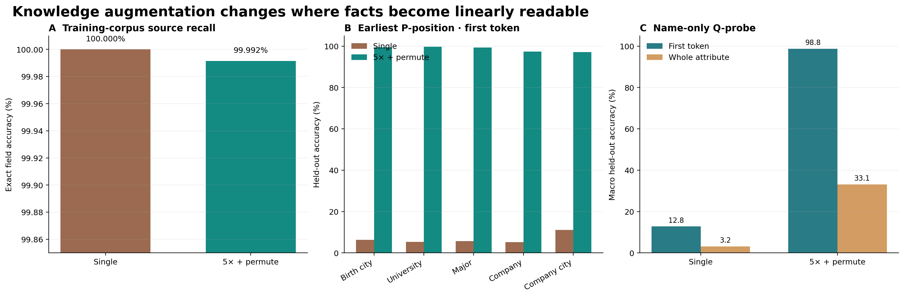

# SynBioS MoE：Knowledge Storage and Extraction

本目录记录在 4×RTX 4090 服务器上完成的 Allen-Zhu Part 3.1 风格受控实验。两种预训练
条件的正式 P/Q probe 对照，以及 `multi5_permute` 的两个 Q-whole inference-only
机制诊断均已完成。

## 实验链路

```text
同一批 100,000 人物 profile
        │
        ├── single：每人 1 篇固定字段顺序 biography
        │      └── 4-GPU FSDP MoE pretraining → strict source-text cloze → 22 formal probes
        │
        └── multi5+permute：每人 5 篇改写、字段随机排列 biography
               └── 4-GPU FSDP MoE pretraining → strict source-text cloze → 22 formal probes
```

两个 backbone 都完成约 4.0B scheduled-token 预训练，并对自己的训练语料达到至少
99.9915% strict progressive-cloze field recall。正式 probe 使用相同人物 split、类别空间、
模型配置和训练预算。

## 正式结论



| Endpoint | `single` | `multi5_permute` | 结论 |
|---|---:|---:|---|
| P0 first，排除 birth date | 6.76% | **98.63%** | augmentation 使事实在最早位置可读 |
| Q first，六属性 macro | 12.83% | **98.79%** | name-to-first-token 机制强复刻 |
| Q whole，五属性 macro | 3.18% | **33.15%** | 有提升，但远低于论文 92.58% |
| Strict source-text field recall | 100.0000% | 99.9915% | 两边都充分记忆预训练语料 |

当前结论必须表述为：

> **First-token knowledge-augmentation mechanism replicated; whole-attribute linear
> readability not replicated on the MoE backbone.**

详细数字、论文对照、限制和审阅问题见
[`formal_comparison.md`](formal_comparison.md)。

## 文件导航

| 文档 | 作用 | 状态 |
|---|---|---|
| [`formal_comparison.md`](formal_comparison.md) | single vs multi5+permute 正式主报告 | **规范 formal 结论** |
| [`diagnostics/README.md`](diagnostics/README.md) | 两个 Q-whole val、全量 whole 对比与重建入口 | **规范诊断结论** |
| [`diagnostics/oracle_first_token.md`](diagnostics/oracle_first_token.md) | 原 Q-whole 与 `+ true t1` 全五属性对照 | 已完成 |
| [`diagnostics/bad_case_routes.md`](diagnostics/bad_case_routes.md) | bad-case 五属性×12层 MoE route 分支 | 已完成 |
| [`formal_protocol.md`](formal_protocol.md) | probe 任务、rank、batch、预算与端点定义 | 已执行 |
| [`formal_training_decision.md`](formal_training_decision.md) | pilot → formal 的工业预算决策 | 历史决策 |
| [`single_formal.md`](single_formal.md) | multi 完成前的 single 阶段报告 | 已被正式对照报告取代 |
| [`pilot_comparison.md`](pilot_comparison.md) | 3,000-step pilot 跨条件结果 | 历史证据 |
| [`pilot_analysis.md`](pilot_analysis.md) | pilot 趋势和风险分析 | 历史证据 |
| [`capacity.md`](capacity.md) | P/Q batch capacity 与吞吐选择 | 已执行 |
| [`q_whole_moe_diagnostics.md`](q_whole_moe_diagnostics.md) | 两个 inference diagnostic 的历史合并报告 | 已由独立报告细化 |

`single_formal.md` 与 pilot 文档作为 provenance 保留，不再作为 headline 结论来源。

## Canonical 机器可读结果

```text
results/formal_runs/synbios_moe/results/formal_probe_comparison_20260724/
├── run_identity.json              两个 run 的 checkpoint/data/cache 身份
├── formal_probe_metrics.csv       154 个 train/held-out position-level 指标
├── headline_metrics.json          报告端点
├── allen_zhu_q_reference.json     Figure 7 参考值与来源
├── summary.json                   总索引
└── figures/
    ├── formal_study_overview.{png,pdf}
    ├── formal_p_first_heatmaps.{png,pdf}
    ├── formal_p_whole_heatmaps.{png,pdf}
    └── formal_q_probe_table.{png,pdf}
```

叙事结论只放在 `reports/`，紧凑机器指标和图放在 `results/`，大日志、probe 权重、recovery
checkpoint 和原始运行事件继续保留在 `/data/mini-train-sys/artifacts/`。

诊断报告的规范机器产物位于：

```text
results/formal_runs/synbios_moe/results/multi5_permute_fsdp_4gpu/
└── probe_pipeline/formal/diagnostics/report/
    ├── summary.json
    ├── formal_whole_metrics.csv
    ├── oracle_metrics.csv
    ├── route_layer_metrics.csv
    ├── route_attribute_layer_metrics.csv
    └── figures/
        ├── complete_whole_comparison.{png,pdf}
        ├── diagnostic_study_overview.{png,pdf}
        ├── oracle_intervention_table.{png,pdf}
        └── route_branching_table.{png,pdf}
```

## 术语边界

- **Training-corpus recall**：backbone 对参与预训练的原始 biography 做严格源文本 progressive
  cloze；不是 held-out 泛化。
- **Probe train recall**：probe head 在其 49,882-person 训练 split 上的分类准确率。
- **Person-held-out probe validation**：同一个 frozen backbone 上，probe head 对另外 50,118
  个人物的跨人物线性可读性；这些人物仍参与过 backbone pretraining。
- **First token**：完整属性在 GPT-2 tokenizer、带前导空格条件下的首 token；生日使用月份。
- **Whole attribute**：把完整属性字符串当作一个类别，不是自回归生成，也不是“预测下一个
  token”。
- **P0…P5**：biography 中六个属性 span 按实际文本顺序排列后，各属性出现前的观察位置。
- **Q-probe**：输入只有 `[EOS, full_name, EOS]`，在最后 EOS 读取 hidden state。

## 复现正式图表

```bash
python scripts/synbios_moe.py report-formal-study \
  --single artifacts/synbios_moe/results/single_fsdp_4gpu/probe_pipeline/formal \
  --multi5-permute artifacts/synbios_moe/results/multi5_permute_fsdp_4gpu/probe_pipeline/formal \
  --single-cloze artifacts/synbios_moe/results/single_cloze_eval/full_100k/summary.json \
  --multi5-permute-cloze artifacts/synbios_moe/results/multi5_permute_cloze_eval/full_500k/summary.json \
  --output artifacts/synbios_moe/results/formal_probe_comparison_20260724
```

该命令会重新读取 44 个独立 validation JSON，并检查 pipeline completion、checkpoint、
dataset/cache SHA256、profile identity、22-task 集合、类别映射和 cloze checkpoint。任何身份
不一致都会拒绝生成图表，防止把错误目录拼成正式结论。
