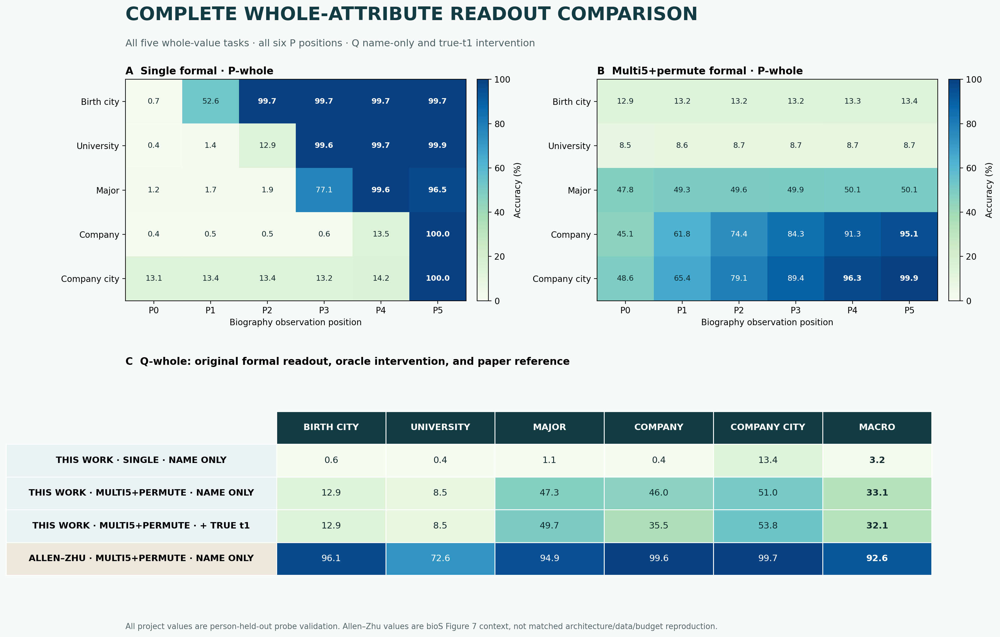

# Q-whole inference diagnostics

本目录是两个 `multi5_permute formal` inference-only 验证的规范入口。两项验证均使用原
formal backbone 与 probe checkpoints，不训练或更新任何参数，并覆盖全部五个 whole-value
属性；没有用抽样属性或只挑好看的层。统一图把原 `single` / `multi5_permute` formal
P-whole P0–P5、原 Q-whole、oracle Q-whole 和 Allen-Zhu 参考值放在同一坐标中，route
图则给出五属性 × 12 层的全部 contrast。



## 核心结论

1. **真实首 token 不能直接解锁原 Q-whole 头。** 在 250,590 个
   person-held-out 预测上，micro accuracy 从 33.15% 变为 32.08%（−1.06pp）。
   该结果否定的是“给不变的 name-only 读出头追加 `t1` 即可恢复 whole”的直接机制，
   不是“`t1` 后的 hidden state 完全没有信息”。
2. **bad cases 显示受控的 token 条件 route 分支。** 162,044 个
   `Q-first correct / Q-whole wrong` 样本中，same-`t2` control 的 branching score 为
   −0.051，different-`t2` 组为 +0.154，difference-in-differences 为 +0.205；
   12 个层级聚合值全部为正，且第 0–3 层最强。
3. **两项结果合起来更符合“轨迹依赖”而不是“单一静态 key”。** whole-value 表示可能依赖
   token、位置、上下文和动态 MoE route 轨迹；当前证据不能证明某个 expert 是事实的
   存储单元，也不能把该现象归因于 augmentation，除非补充 matched `single` 诊断。

## 报告导航

- [Oracle true-first-token intervention](oracle_first_token.md)
- [Bad-case MoE route branching](bad_case_routes.md)
- [single vs multi5+permute formal 主报告](../formal_comparison.md)
- [历史合并报告](../q_whole_moe_diagnostics.md)

## 规范结果结构

- Machine summary：
  [`summary.json`](../../../../results/formal_runs/synbios_moe/results/multi5_permute_fsdp_4gpu/probe_pipeline/formal/diagnostics/report/summary.json)
- 全量 formal whole 指标：
  [`formal_whole_metrics.csv`](../../../../results/formal_runs/synbios_moe/results/multi5_permute_fsdp_4gpu/probe_pipeline/formal/diagnostics/report/formal_whole_metrics.csv)
- Oracle tidy metrics：
  [`oracle_metrics.csv`](../../../../results/formal_runs/synbios_moe/results/multi5_permute_fsdp_4gpu/probe_pipeline/formal/diagnostics/report/oracle_metrics.csv)
- Route layer metrics：
  [`route_layer_metrics.csv`](../../../../results/formal_runs/synbios_moe/results/multi5_permute_fsdp_4gpu/probe_pipeline/formal/diagnostics/report/route_layer_metrics.csv)
- Route attribute × layer metrics：
  [`route_attribute_layer_metrics.csv`](../../../../results/formal_runs/synbios_moe/results/multi5_permute_fsdp_4gpu/probe_pipeline/formal/diagnostics/report/route_attribute_layer_metrics.csv)
- 完整图表：
  [`figures/`](../../../../results/formal_runs/synbios_moe/results/multi5_permute_fsdp_4gpu/probe_pipeline/formal/diagnostics/report/figures/)

大体积逐样本证据保留在 `/data` 下原 diagnostic 目录，Git 只保存其大小和 SHA256
manifest，不复制原始样本或模型权重。

## 重建命令

```bash
python scripts/synbios_moe.py report-probe-diagnostics \
  --single-formal artifacts/synbios_moe/results/single_fsdp_4gpu/probe_pipeline/formal \
  --multi5-permute-formal artifacts/synbios_moe/results/multi5_permute_fsdp_4gpu/probe_pipeline/formal \
  --diagnostics artifacts/synbios_moe/results/multi5_permute_fsdp_4gpu/probe_pipeline/formal/diagnostics \
  --output artifacts/synbios_moe/results/multi5_permute_fsdp_4gpu/probe_pipeline/formal/diagnostics/report
```

生成器会拒绝不完整 formal pipeline、不同 checkpoint/data/cache/probe 目录、错误 split、
不完整的五属性×12层矩阵、摘要计数不闭合或 raw artifact hash 不匹配。
