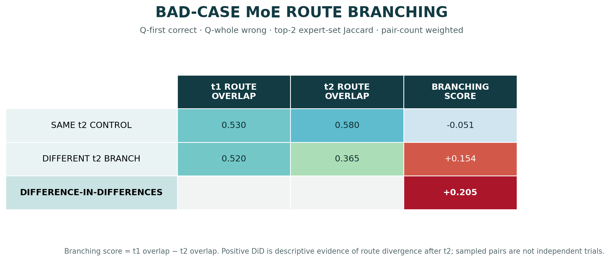
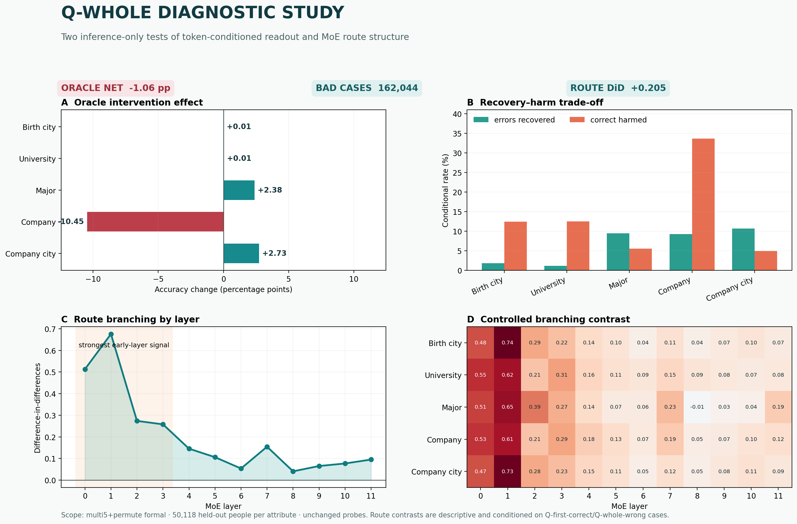

# Bad-case MoE route branching

## 问题与假设

问题是：对于 `Q-first correct / Q-whole wrong` 的人物，属性序列是否先按共同首 token
经过相似 MoE route，并在第二 token 不同时出现可测的 route 分支？

该假设只预测动态 routing contrast，不等价于“expert 是事实存储位置”，也不预测原
Q-whole 线性头一定能读出完整属性。

## 精确比较条件

- Bad case：Q-first 正确、Q-whole 错误、ground-truth whole value 至少包含两个 token。
- 输入：在姓名后追加 ground-truth `t1` 和 `t2`；记录两个位置在 12 层的 top-2 experts。
- Route model：冻结预训练 backbone；不加入 Q probe embedding delta。
- 配对单位：同一属性、同一 `t1`。
- Control：配对样本具有相同 `t2`。
- Branch：配对样本具有不同 `t2`。
- `branching_score = Jaccard(route_t1) − Jaccard(route_t2)`。
- Difference-in-differences：
  `branching_score(different t2) − branching_score(same t2)`。

所有五个 whole-value 属性均参与。pair sampler 对每个可配对 `t1` group 使用固定 seed
1337 和上限 2,000；汇总按实际 sampled-pair count 加权。

## Run、checkpoint 与数据身份

- Condition、backbone、data、cache、probe heads 与
  [Oracle 报告](oracle_first_token.md)完全相同。
- MoE topology：12 layers、8 experts、top-2 routing。
- Bad cases：162,044。
- Split：person-held-out probe validation。
- 原始运行与命令：`HISTORY.md` 的
  “2026-07-24 00:35 — Multi5+permute Q-whole inference diagnostics”。

## 主要指标

| 配对组 | `t1` route overlap | `t2` route overlap | branching score |
|---|---:|---:|---:|
| Same-`t2` control | 0.530 | 0.580 | −0.051 |
| Different-`t2` branch | 0.520 | 0.365 | +0.154 |
| **Difference-in-differences** |  |  | **+0.205** |

Same-`t2` control 汇总 2,424,000 个 sampled comparisons；different-`t2` 汇总
2,232,000 个。它们包含重复抽样且共享样本，不是数百万个独立统计试验，因此这里只报告
descriptive effect size，不给伪精确的独立样本显著性。

## 全属性、全层结果

按 layer 汇总的 difference-in-differences 为：

`[0.513, 0.676, 0.274, 0.258, 0.146, 0.106, 0.054, 0.155, 0.041, 0.065, 0.077, 0.095]`。

12 个层级聚合值全部为正；第 0–3 层明显更强。五属性×12层矩阵显示该趋势跨属性较一致，
但并非每个单元都为正，例如 major layer 8 约为 −0.01。top-1 expert 与 token identity
也存在中等 NMI：各属性最大 `t1` NMI 为 0.360–0.551，最大 `t2` NMI 为 0.563–0.651。

## 支持证据

- [Machine summary](../../../../results/formal_runs/synbios_moe/results/multi5_permute_fsdp_4gpu/probe_pipeline/formal/diagnostics/report/summary.json)
- [Layer aggregates](../../../../results/formal_runs/synbios_moe/results/multi5_permute_fsdp_4gpu/probe_pipeline/formal/diagnostics/report/route_layer_metrics.csv)
- [Attribute × layer matrix](../../../../results/formal_runs/synbios_moe/results/multi5_permute_fsdp_4gpu/probe_pipeline/formal/diagnostics/report/route_attribute_layer_metrics.csv)
- `/data` bad cases：35,427,725 bytes，SHA256
  `49704099549787560dfe4805d69f1e44aef4d2e5f8cb1c80dc2bf0640c97ad7f`。
- `/data` route records：113,662,982 bytes，SHA256
  `2a33ceda133449142a81b6b8fe7da2b7707f2c08c5ead42937e36704f48e7061`。

## 解释

受控 contrast 支持一个较窄的机制描述：共享 `t1` 的 bad cases 在 `t1` 位置 route 相似，
不同 `t2` 到来后 route overlap 明显下降；same-`t2` control 没有同等下降。信号集中在
早层，说明 token identity 对路径选择的影响较早出现，随后在中后层减弱但没有在聚合上
消失。

这与“属性序列沿 token 条件路径展开”相容，也解释了为什么姓名位置的单个静态 Q-whole
读出可能弱于 first-token 读出。但 route 只是计算路径，不等于参数中知识的物理存储地址。

## 局限与有效性威胁

- 分析条件化在 bad cases 上，不能外推为全部人物的 route 分布。
- 配对重复使用样本，pair counts 不是独立样本量；当前没有 person-level bootstrap
  confidence interval。
- 相同 token 的 route 相似性仍可能受到 token embedding、频率和语法混杂。same-`t2`
  control 与 difference-in-differences 降低但没有消除这些混杂。
- Route forward 不加入 probe embedding delta；它隔离了 backbone routing，但不等价于
  probe 实际读出轨迹。
- 缺少 matched `single` route diagnostic，不能把 +0.205 归因于 multi5+permute
  augmentation 或 MoE 相对于 dense 模型的差异。

## 下一决策

若要检验“augmentation 改变 route 分支结构”，下一项必要实验是在 `single formal` 上用
完全相同 protocol 和 seed 重跑，并进行 person-level paired/bootstrap 对照。只有
multi5 的 effect 明显强于 single，且控制 token frequency 后仍稳定，才应升级为
augmentation-specific 结论。
