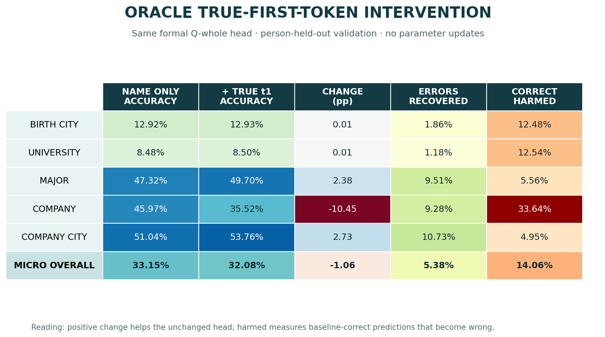

# Oracle true-first-token intervention

## 问题与假设

问题是：`multi5_permute` 的 Q-whole 较弱，是否只是因为姓名位置缺少属性首 token？若给定
ground-truth `t1`，不改变已经训练好的 Q-whole 头，它能否直接恢复完整属性？

## 精确比较条件

| 条件 | 输入 | 读出位置 | 参数更新 |
|---|---|---|---|
| 原 formal 基线 | `[EOS, name, EOS]` | 末尾 EOS | 无 |
| Oracle intervention | `[EOS, name, ground_truth_t1, EOS]` | 新末尾 EOS | 无 |

五个 whole-value 属性全部评估，每个属性 50,118 名 person-held-out 人物，共 250,590 次
预测。原始 name-only accuracy 已逐属性与 formal Q-whole JSON 对照；整数计数重算值与
formal float32 值在 `1e-7` 内一致。

## Run、checkpoint 与数据身份

- Condition：`multi5_permute formal`。
- Backbone：`epoch_000108_step_000017388`；model SHA256
  `e89075289bb3a774825e7fd03cedc2c7c37957583bf3656e8ab32c52ef02f0dd`。
- Probe：原 formal Q-whole heads，rank 16，12,000 optimizer steps。
- Data manifest SHA256：
  `31b99dd8d415007c34e00e3b32440014be4b34c27b7c3c1a80f7e1319019566e`。
- Probe-cache manifest SHA256：
  `acd78360d0daa7cf0d2c557fc9f68f07431bc3063cee1145daa3f14c320a232f`。
- Split：person-held-out probe validation。人物对 probe-head training 是 held out，
  但 backbone 预训练见过这些人物，不能称为预训练 held-out generalization。
- 生命周期与原命令：`HISTORY.md` 的
  “2026-07-24 00:35 — Multi5+permute Q-whole inference diagnostics”。

## 主要指标

| 属性 | name-only | + true `t1` | Δ | 基线错误恢复 | 基线正确受损 |
|---|---:|---:|---:|---:|---:|
| Birth city | 12.92% | 12.93% | +0.01pp | 1.86% | 12.48% |
| University | 8.48% | 8.50% | +0.01pp | 1.18% | 12.54% |
| Major | 47.32% | 49.70% | +2.38pp | 9.51% | 5.56% |
| Company | 45.97% | 35.52% | −10.45pp | 9.28% | 33.64% |
| Company city | 51.04% | 53.76% | +2.73pp | 10.73% | 4.95% |
| **Micro overall** | **33.15%** | **32.08%** | **−1.06pp** | **5.38%** | **14.06%** |

Oracle 恢复了 9,009 个基线错误，但破坏了 11,675 个原本正确的预测。净下降主要由
company 的 −10.45pp 驱动；major 和 company city 局部改善，说明影响具有显著
attribute heterogeneity，不能只看 micro 平均值。

## 与全部原 whole 结果的关系

该图同时呈现：

- `single` 和 `multi5_permute` 的全部 P-whole P0–P5；
- 两组原 formal Q-whole name-only；
- `multi5_permute + true t1`；
- Allen-Zhu bioS multi5+permute Figure 7 的上下文参考。

Oracle micro 32.08% 不仅没有高于原 multi Q-whole 的 33.15%，也没有缩小到
Allen-Zhu 92.58% 参考值的主要差距。因此，当前 whole 失败不是一个可由“追加正确首
token + 复用原线性头”解释的简单缺 key 问题。

## 支持证据

- [Machine summary](../../../../results/formal_runs/synbios_moe/results/multi5_permute_fsdp_4gpu/probe_pipeline/formal/diagnostics/report/summary.json)
- [Oracle tidy metrics](../../../../results/formal_runs/synbios_moe/results/multi5_permute_fsdp_4gpu/probe_pipeline/formal/diagnostics/report/oracle_metrics.csv)
- `/data` raw records：
  `.../formal/diagnostics/oracle_first_token/records.csv`，41,919,710 bytes，
  SHA256 `7b72f4b46e1e8ed841395eebbecdd52a327d22953c494a9c81afb5fdcac74095`。

## 解释

结果不支持“真实 `t1` 是一个能被原 Q-whole 读出头直接消费的离散 key”。更窄且与证据
一致的解释是：whole-value 可读出性依赖 readout 位置、序列长度、hidden-state 演化和
probe embedding delta 所适配的输入分布。局部恢复说明 `t1` 能改变预测，但它没有以
普适、稳定的方式把原头带到正确 whole class。

## 局限与有效性威胁

- 干预改变了序列长度和 EOS readout 位置；原 Q-whole 头只在 name-only EOS 上训练，
  因此这是 out-of-distribution transport test。
- 该实验检验“不重新训练的原头能否直接利用 `t1`”，不检验重新训练一个 matched
  `[EOS, name, true_t1, EOS]` readout 后能否提取信息。
- 只执行了 `multi5_permute` 诊断；没有 matched `single` oracle，因此不能把干预响应
  差异归因于 augmentation。
- 这是 probe-head held-out validation，不是 backbone 未见人物上的泛化。

## 下一决策

保留该结果作为零训练机制否证。若下一步研究“信息是否存在但坐标系改变”，应单独训练
matched-context Q-whole head，并与本次 unchanged-head 指标严格分开；若研究 augmentation
效应，应先在 `single formal` 上执行完全相同的 unchanged-head oracle protocol。
