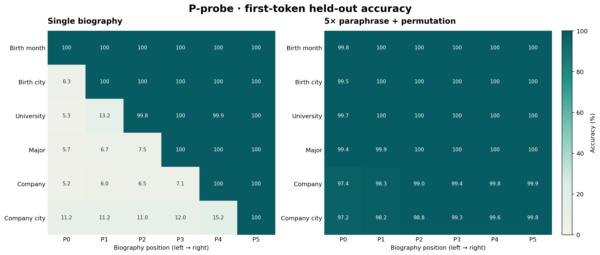
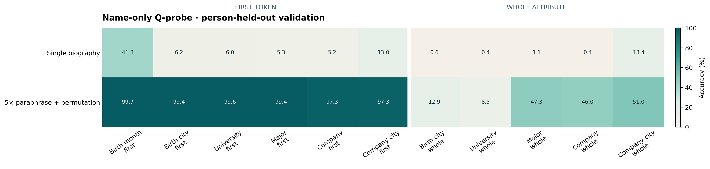
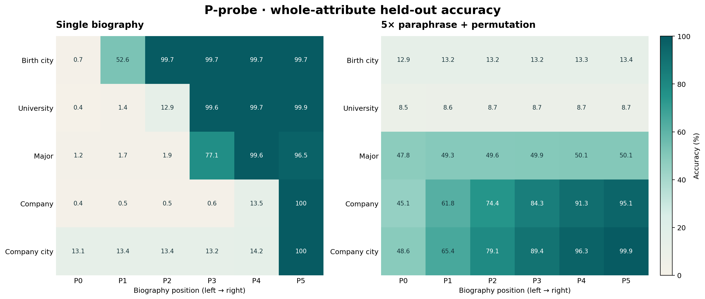

# Single vs. Multi5+Permute：正式 P/Q Probe 对照

> 审阅状态：**第一阶段正式结果已确认。**
> 主结论：first-token 机制复刻成功；whole-attribute 端点未达到原论文水平，因此整体应称为
> **partial replication（部分复刻）**，不能写成完整复刻。

## 1. 问题与假设

本实验检验 Allen-Zhu 与 Li 在
[Physics of Language Models: Part 3.1](https://arxiv.org/abs/2309.14316)
中提出的机制性结论：在预训练语料中对同一人物事实进行改写和字段顺序扰动，会使事实更早、
更直接地与人物姓名表示建立近线性联系。

预注册式判断标准是：

1. `single` 应在 P-probe 上形成位置依赖的阶梯：目标事实尚未出现时接近类别先验，抵达目标
   字段后接近 100%；
2. `multi5_permute` 应从最早 P 位置就能读取 first token；
3. name-only Q-probe 的 first-token accuracy 应在 augmentation 后大幅上升；
4. whole-attribute 是更严格的次要端点。若它没有同步达到论文水平，必须单独报告，不能由
   first-token 结果代替。

## 2. 精确比较条件

| 条件 | 人物 | 每人文本 | 预训练文本 | 文本结构 |
|---|---:|---:|---:|---|
| `single` | 100,000 | 1 | 100,000 | 固定字段顺序，随机模板 |
| `multi5_permute` | 100,000 | 5 | 500,000 | 五次独立改写，字段随机排列 |

两个条件使用完全相同的 `profiles.jsonl`：
SHA256 `7d239f046cb5e16ac3d8d7636b6901a2430f2ccb8dc1179063e4eaed92256da1`。
因此人物、姓名、属性真值、person-level probe split 和类别空间完全匹配；变化的是预训练
文本的 multiplicity、surface realization 和字段顺序。

模型均为 12 层、hidden size 768 的 causal Transformer，使用 8-expert、top-2 MoE FFN：
293.49M total parameters，约 123.62M active parameters/token。训练均采用 BF16、4-GPU FSDP、
global batch 448，并匹配约 4.0B scheduled tokens。

| 条件 | Epoch | Optimizer steps | Scheduled tokens | 最终 total loss |
|---|---:|---:|---:|---:|
| `single` | 540 | 17,280 | 3,963,617,280 | 0.193221 |
| `multi5_permute` | 108 | 17,388 | 3,988,389,888 | 0.296150 |

Probe 配置在两个条件间完全一致：

| Endpoint | Embedding-delta rank | Train batch | Steps | Validation batch |
|---|---:|---:|---:|---:|
| P first | 2 | 128 | 4,000 | 512 |
| Q first | 16 | 768 | 4,000 | 6,144 |
| P whole | 2 | 128 | 12,000 | 512 |
| Q whole | 16 | 768 | 12,000 | 6,144 |

P/Q 各自包含 11 个独立分类头：6 个 first-token 任务和 5 个 whole-attribute 任务；生日没有
whole 分类。每个 formal pipeline 均完成 22/22 训练任务和 22/22 checkpoint-reloaded
validation，最终形成 77 个 position-level held-out 数值。

## 3. Run、checkpoint 与数据身份

| 条件 | Backbone checkpoint | Model SHA256 | Data manifest SHA256 | Probe-cache SHA256 |
|---|---|---|---|---|
| `single` | `epoch_000540_step_000017280` | `2d154f…039e84` | `144cf4…11e25` | `9dcfd2…ffaf5b` |
| `multi5_permute` | `epoch_000108_step_000017388` | `e89075…2f0dd` | `31b99d…19566e` | `acd783…0a232f` |

Probe validation 的“held-out”含义是：分类头在 49,882 个 profile 上训练，在另外 50,118
个人物上评估；backbone 在预训练阶段见过全部 100,000 人。它测量跨人物一致的线性可读性，
不是“backbone 对未见人物的泛化”。

P validation 的样本数分别是 50,118 篇 `single` biography 和 250,590 篇 augmented
biography；Q validation 两边都是同一批 50,118 个 name-only 输入。

## 4. 主要指标

### 4.1 严格源文本填充：两边都已充分记住预训练语料

| 条件 | 评估文本 | 字段 | Strict exact fields | 6/6 biography accuracy |
|---|---:|---:|---:|---:|
| `single` | 100,000 | 600,000 | **100.000000%** | **100.0000%** |
| `multi5_permute` | 500,000 | 3,000,000 | **99.991533%** | **99.9626%** |

这里采用 progressive original-biography cloze：精确移除六个源文本 fact span，按源文本顺序
greedy 生成，并把较早预测放回后续上下文。它是 **training-corpus recall**，不是 held-out
validation。其作用是排除“multi 的 probe 较弱只是因为 backbone 没记住训练文本”这一解释。

### 4.2 P-probe first token：核心机制复刻成功

| 正式端点 | `single` | `multi5_permute` | Δ |
|---|---:|---:|---:|
| P0 first，排除固定首字段 birth date | 6.76% | **98.63%** | **+91.87pp** |
| 固定顺序目标位置对角线 first | **99.97%** | 99.87% | −0.10pp |

`single` 呈清晰下三角结构：birth city 到 P1、university 到 P2、major 到 P3、company 到
P4、company city 到 P5 后才接近 100%。`multi5_permute` 的六个属性从 P0 起即为
97.18%–99.76%，随后进一步接近 100%。这直接复现原论文 Figure 5 的主要定性模式：
augmentation 把 first-token 信息从“依赖已读 biography 上下文”转为“人物姓名后立即可读”。

### 4.3 Q-probe first token：name-only 表示的主结果复刻成功

| Q-first | Birth month | Birth city | University | Major | Company | Company city | Macro |
|---|---:|---:|---:|---:|---:|---:|---:|
| `single` | 41.30 | 6.20 | 6.00 | 5.30 | 5.16 | 13.03 | **12.83** |
| `multi5_permute` | 99.74 | 99.41 | 99.61 | 99.40 | 97.33 | 97.26 | **98.79** |
| Δ | +58.44 | +93.21 | +93.61 | +94.10 | +92.17 | +84.23 | **+85.96pp** |

Q 输入严格为 `[EOS, full_name, EOS]`，只读取末尾 EOS 的最后层 hidden state。该结果说明，
在 first-token 粒度上，multi5+permute backbone 为未参与 probe 训练的人物形成了高度一致的
name-to-attribute 近线性表示。

### 4.4 Whole attribute：提升真实，但未复刻原论文的高准确率

| Whole endpoint（5 属性 macro） | `single` | `multi5_permute` | Δ |
|---|---:|---:|---:|
| P0 whole | 3.16% | **32.59%** | +29.43pp |
| P5 whole | **99.21%** | 53.42% | −45.79pp |
| Q whole | 3.18% | **33.15%** | +29.97pp |

Multi 的 Q-whole 分属性准确率为 birth city 12.92%、university 8.48%、major 47.32%、
company 45.97%、company city 51.04%。这明显高于 single 的 0.40%–13.42%，但远低于原论文
bioS multi5+permute 的 72.6%–99.7%。

该差异不是简单的 optimizer 未拟合：multi Q-whole 的 probe-train recall 分别达到
74.51%、86.75%、82.84%、98.18%、92.06%，但 held-out 分别只有
12.92%、8.48%、47.32%、45.97%、51.04%。这是明显的跨人物 linear-readout
generalization gap。

### 4.5 与 Allen-Zhu bioS 结果的对齐程度

原论文使用 dense GPT2-small、paper-specific bioS 候选池和 30,000 probe steps；本项目使用
active-size 相近但 total-size 更大的 MoE，并使用自己的可审计 SynBioS 生成器和
pilot-derived 4k/12k 预算。因此下表用于判断机制是否复现，不应当作逐点数值复现：

| Endpoint | 论文 bioS single | 本项目 single | 论文 bioS multi5+permute | 本项目 multi5+permute | 判断 |
|---|---:|---:|---:|---:|---|
| P-first earliest position | 低，目标出现后≈100 | 6.76%，目标处99.97 | ≈100 | 98.63 | **定性复刻** |
| Q-first macro | 19.87 | 12.83 | 99.93 | 98.79 | **强复刻** |
| Q-whole macro | 2.90 | 3.18 | 92.58 | 33.15 | **未复刻** |
| P-whole P0 macro | single 为位置依赖 | 3.16 | 约93.5 | 32.59 | **未复刻** |

论文参考数字来自 arXiv v3 Figure 7；P-whole 参考来自 Figure 13。论文自己也区分
first-token 和 whole-attribute，因此不能用 first 的成功替代 whole 的失败。

## 5. 支持产物

- Canonical machine summary：
  [`summary.json`](../../../results/formal_runs/synbios_moe/results/formal_probe_comparison_20260724/summary.json)
- Run identity 与 lineage：
  [`run_identity.json`](../../../results/formal_runs/synbios_moe/results/formal_probe_comparison_20260724/run_identity.json)
- 154 个 train/validation position-level 指标：
  [`formal_probe_metrics.csv`](../../../results/formal_runs/synbios_moe/results/formal_probe_comparison_20260724/formal_probe_metrics.csv)
- Headline endpoints：
  [`headline_metrics.json`](../../../results/formal_runs/synbios_moe/results/formal_probe_comparison_20260724/headline_metrics.json)
- 原论文 Q 参考值及来源：
  [`allen_zhu_q_reference.json`](../../../results/formal_runs/synbios_moe/results/formal_probe_comparison_20260724/allen_zhu_q_reference.json)
- 四张主图（PNG + vector PDF）：
  [`figures/`](../../../results/formal_runs/synbios_moe/results/formal_probe_comparison_20260724/figures/)
- Formal pipeline：
  `artifacts/synbios_moe/results/{single,multi5_permute}_fsdp_4gpu/probe_pipeline/formal/`
- 运行与失败历史：`HISTORY.md`。

## 6. 解释

证据支持以下较窄但可靠的结论：

1. 两个 backbone 都几乎完美回忆自己的预训练文本，因此实验比较的不是“记住/没记住”。
2. 未增强 single 将 first-token 信息以强位置依赖形式组织；读到对应字段后，P probe 才能
   近乎完美恢复。
3. 五次改写与字段置换使 first-token 属性在人物姓名后立即以跨人物一致的方式线性可读；
   P0 与 name-only Q 的巨大提升相互印证。
4. 同一改变没有在本 MoE 上产生同等强度的完整字符串表示。Whole 的训练拟合很高、held-out
   较低，说明问题更像是 representation/readout 的跨人物一致性，而不是 probe optimization
   尚未完成。

因此，目前最专业的表述是：

> **本项目在 MoE backbone 上复现了 Allen-Zhu 的 first-token knowledge-augmentation
> mechanism，但未复现 dense GPT2-small 上的 whole-attribute linear readability。**

## 7. 局限与有效性威胁

- **架构差异**：论文主结果是 dense GPT2-small；本项目是 8-expert top-2 MoE。Active
  parameter count 相近不等于表示机制相同。
- **数据差异**：本项目保持论文的 100k people、single/multi5+permute 结构和六属性任务，
  但候选池、模板文本及 first-token 类别先验不是原论文原始字节。因此应比较结构与趋势，
  不能要求 chance-level 数字逐点相同。
- **预算差异**：论文 probe 为 30,000 steps（P batch 50、Q batch 200）；本项目根据 pilot
  使用 first 4,000、whole 12,000 steps 和更大 batch。样本 exposure 接近或超过论文，但
  optimizer-step 数不相同。
- **Whole 是单分类器**：whole probe 预测完整属性类别，不是自回归逐 token 生成；它测量
  完整值的线性可分性，不等同于模型在正常 generation 中的 next-token 能力。
- **Probe held-out 不是 backbone OOD**：held-out 人物仅未参与 probe-head 训练，仍参与过
  backbone pretraining。
- **单次 seed**：两个条件均为 seed 1337；当前没有跨 seed 置信区间。

## 8. 下一决策

第一阶段到此停止，等待审阅。建议审阅时明确确认两点：

1. 是否接受“first-token 成功、whole-attribute 未复刻”的分层结论；
2. 是否接受将 MoE architecture difference 作为下一阶段两个 inference-only validation
   的主假设，而不是事后把 whole 结果解释成成功。

审阅通过后，再进入第二阶段：整理 oracle true-first-token intervention 与 bad-case
token-conditioned MoE routing 两个 validation 的正式报告和对照图。
