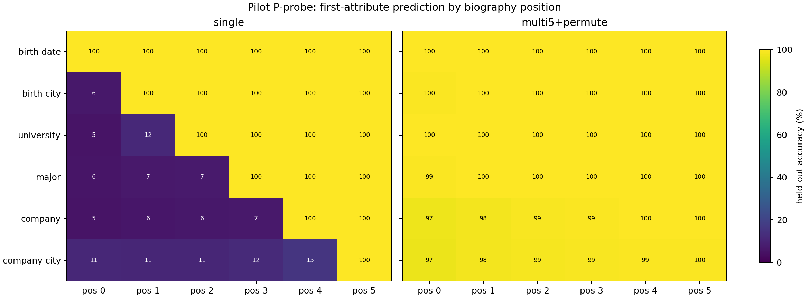
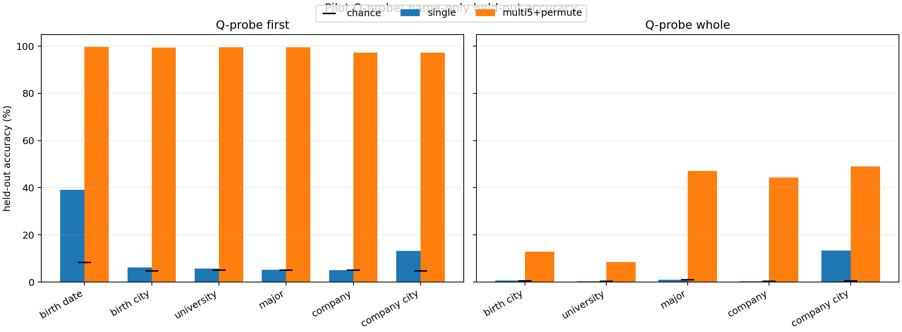
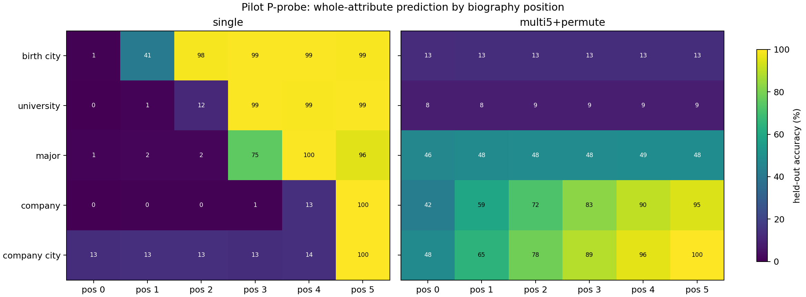

# Allen-Zhu P/Q probe pilot analysis

## Decision

The pilot trend gate passes for the paper's main representation claim:

- `single` stores first-token facts in a position-dependent pattern. Except for birth date, which
  is the first field, mean P accuracy at position 0 is only **6.71%**; each attribute rises sharply
  when its own fixed biography position is reached.
- `multi5+permute` makes the same first-token facts available directly from the name/context
  prefix. Mean position-0 P accuracy over the same five non-birthday fields is **98.63%**.
- Name-only Q first-token accuracy rises from **12.42%** mean for `single` to **98.80%** for
  `multi5+permute`.

This is the qualitative difference reported in Allen-Zhu and Li's [Figure 5 and Figure
7](https://arxiv.org/abs/2309.14316): fixed single biographies encourage local/ordered
memorization, while multiplicity plus permutation makes facts directly associated with the
person's name.

The pilot does **not** establish converged whole-attribute results. Those tasks deliberately remain
a formal-run target.

## Protocol and data

Both backbones are completed 4-GPU FSDP runs. Every probe freezes the backbone and uses the
paper-style embedding update and classifier: rank 2 for P, rank 16 for Q, AdamW, dropout enabled
in the frozen backbone, and a linear decay schedule. All reported numbers are from a separately
reloaded checkpoint on people excluded from probe training.

| Condition | Probe | Unique train pool | Held-out validation pool | Pilot batch × steps | Equivalent train passes |
|---|---|---:|---:|---:|---:|
| single | P biography | 50,000 | 50,000 | 128 × 3,000 | 7.68 |
| multi5+permute | P biography | 250,000 | 250,000 | 128 × 3,000 | 1.536 |
| both | Q name-only | 50,000 | 50,000 | 768 × 3,000 | 46.08 |

The split is person-level. The multi5 P pool contains five separately rendered/permuted
biographies for each person; Q contains one name-only input per person.

## First-token results

### P-probe at biography position 0

| Attribute | Chance | single | multi5+permute | Delta |
|---|---:|---:|---:|---:|
| birth date | 8.33% | 100.00% | 99.75% | -0.25 pp |
| birth city | 4.76% | 6.30% | 99.51% | +93.21 pp |
| university | 5.00% | 5.39% | 99.68% | +94.29 pp |
| major | 5.00% | 5.51% | 99.44% | +93.93 pp |
| company | 5.00% | 5.23% | 97.39% | +92.16 pp |
| company city | 4.76% | 11.15% | 97.11% | +85.96 pp |

Birth date is expected to be available at position 0 in `single`, because it is the first fixed
field; it must not be averaged into the test of "knowledge before its own field." All other
attributes are close to their low-cardinality chance levels in `single` and above 97% in the
augmented condition.

### Name-only Q-probe

| Attribute | single | multi5+permute | Delta |
|---|---:|---:|---:|
| birth date | 39.17% | 99.74% | +60.57 pp |
| birth city | 6.21% | 99.44% | +93.23 pp |
| university | 5.76% | 99.61% | +93.85 pp |
| major | 5.15% | 99.48% | +94.33 pp |
| company | 5.10% | 97.31% | +92.21 pp |
| company city | 13.13% | 97.20% | +84.07 pp |

## Whole-attribute diagnostic

Whole prediction has 100--300 classes and is intentionally harder. At 3,000 steps:

- Mean Q whole accuracy is **3.14%** for `single` and **32.34%** for `multi5+permute`.
- Mean P whole position-0 accuracy is **3.11%** for `single` and **31.47%** for
  `multi5+permute`.
- Multi5 train-to-validation gaps remain large on several fields: for example Q university whole
  is 77.6% on probe-train people but 8.46% on held-out people.

The direction already favors augmentation, but the pilot learning-rate schedule has reached zero
after only 384,000 P or 2,304,000 Q sampled examples. The paper exposes P/Q probes to about
1.5M/6.0M examples. Whole results are therefore classified as **supportive but unconverged**, not
as a failed reproduction.

## Reliability assessment

The primary trend is credible enough to promote:

1. The evaluation is a full held-out population scan: 50,000 unseen people, or 250,000 unseen
   biographies for augmented P.
2. The first-token effect is 86--94 percentage points for every non-birthday attribute, far larger
   than sampling noise or class-imbalance baselines.
3. P and Q agree independently: early biography positions and name-only inputs both become
   predictive only after augmentation.
4. The `single` heatmap has the expected lower-triangular boundary rather than indiscriminate
   100% accuracy.
5. All 44 training/validation tasks completed from checkpoint reload with no OOM, NaN, missing
   classes, or identity mismatch.

Limitations: the pilot uses one probe seed and is not a variance study; whole-attribute
generalization is not converged. The formal run must preserve the first-token result and test
whether paper-equivalent sample exposure closes the whole-task gaps.

## Evidence

- Cross-condition raw/tidy reduction:
  `artifacts/synbios_moe/results/probe_pilot_comparison/`
- Git-exported single pilot:
  `results/formal_runs/synbios_moe/results/single_fsdp_4gpu/probe_pipeline/pilot/`
- Git-exported multi5 pilot:
  `results/formal_runs/synbios_moe/results/multi5_permute_fsdp_4gpu/probe_pipeline/pilot/`
- Lifecycle, exact commands, Git state, sessions, and logs: repository-root `HISTORY.md`.
